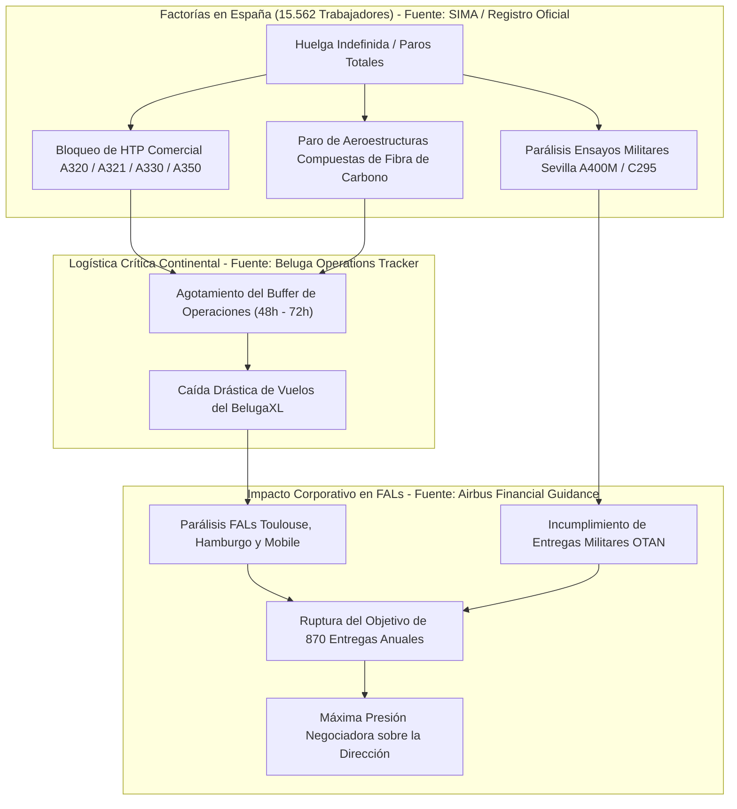
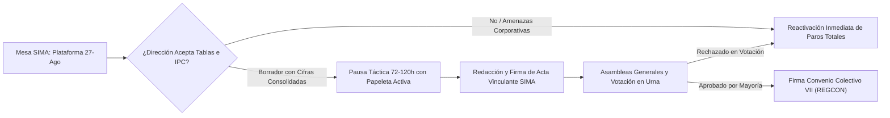
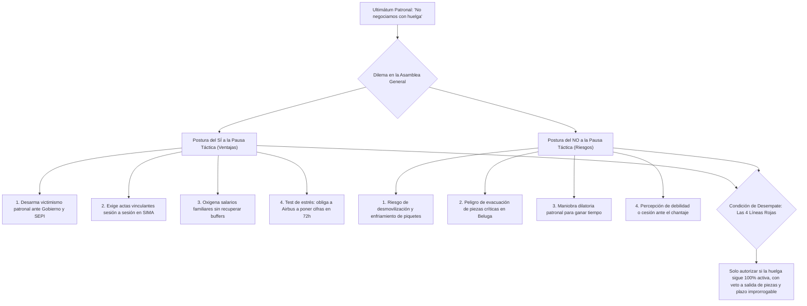
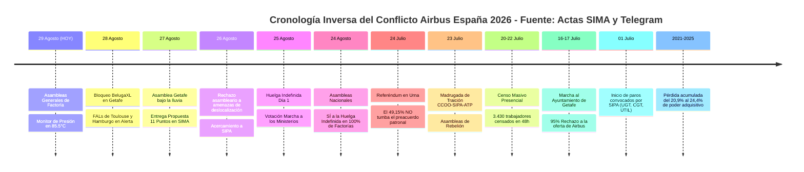

# GUÍA ESTRATÉGICA Y TÁCTICA DE NEGOCIACIÓN: HUELGA AIRBUS ESPAÑA 2026

**Documento Ejecutivo para la Acción Sindical, la Comisión Negociadora y la Plantilla**  
*Fuentes primarias y registros oficiales indexados con acceso directo:*
* [Actas Oficiales de Mediación en el SIMA (Julio-Agosto 2026)](https://www.sima-fasp.net/)
* [Dossier de Recuperación de Poder Adquisitivo en Airbus España (INE / Banco de España / BCE)](https://www.ine.es/)
* [VI Convenio Colectivo Interempresas de Airbus (BOE núm. 297/2021)](https://www.boe.es/diario_boe/txt.php?id=BOE-A-2021-19616)
* [V Convenio Colectivo Interempresas de Airbus (BOE núm. 165/2015)](https://www.boe.es/diario_boe/txt.php?id=BOE-A-2015-7768)
* [Informes Financieros Anuales y Resultados FY2025 de Airbus SE](https://www.airbus.com/en/investors/financial-results-and-annual-reports)
* [Cotización Oficial Euronext París: Airbus SE (AIR.PA)](https://live.euronext.com/en/product/equities/NL0000235190-XPAR)
* [Marco Legal Laboral: Real Decreto Legislativo 2/2015 (Estatuto de los Trabajadores)](https://www.boe.es/buscar/act.php?id=BOE-A-2015-11430)
* [Regulación del Derecho de Huelga: Real Decreto-ley 17/1977](https://www.boe.es/buscar/act.php?id=BOE-A-1977-6017)
* [Jurisprudencia Constitucional: STC 11/1981 sobre Derecho de Huelga](https://hj.tribunalconstitucional.es/es/Resolucion/Show/11)
* [Registro Oficial de Elecciones Sindicales: CCOO Industria Aeroespacial](https://industria.ccoo.es/Aeroespacial)
* [Registro Oficial de Elecciones Sindicales: UGT FICA](https://ugt-fica.org/)
* [Canal Oficial de la Plantilla en Telegram: "EnfadadosconAirbus" (5.794 miembros)](https://t.me/+MnuqJDCAAgYyMGQ0)

---

## 1. Diagnóstico de Poder: La Ventaja Asimétrica de la Plantilla

Airbus opera bajo un modelo de producción transnacional altamente integrado y logística *just-in-time* (JIT). Esta arquitectura otorga a las factorías españolas (Getafe, Illescas, Cádiz y Sevilla) una capacidad de bloqueo estructural sobre el conjunto de las Líneas de Ensamblaje Final (FAL) europeas `[Fuente: Airbus Operations Industrial Mapping & Supply Chain Architecture: https://www.airbus.com/en/our-worldwide-presence/airbus-in-europe/airbus-in-spain]`:

1. **Monopolio Productivo del Estabilizador Horizontal (HTP):**
   * La factoría de Getafe ensambla y equipa en régimen de **proveedor único y exclusivo (*single-source*)** los HTP de **toda la familia de aviones comerciales de Airbus** (A320, A321XLR, A330 y A350/A350F) `[Fuente: Airbus Aircraft Production Directory: https://www.airbus.com/en/products-services/commercial-aircraft]`.
   * Las factorías de Illescas y Puerto Real/Cádiz fabrican en exclusiva aeroestructuras primarias de fibra de carbono y revestimientos alares esenciales `[Fuente: Composites Manufacturing Capabilities Airbus Spain: https://industria.ccoo.es/Aeroespacial]`.
   * La imposibilidad regulatoria de transferir útiles y líneas certificadas por la Agencia Europea de Seguridad Aérea `[Fuente: EASA Part-21 & CS-25 Airworthiness Directives: https://www.easa.europa.eu/]` impide cualquier deslocalización a corto/medio plazo sin paralizar las entregas mundiales.
   * Con los inventarios de seguridad (*buffers*) de componentes agotados tras las jornadas de huelga acumuladas en julio, la paralización del suministro desde España detiene en cascada las FAL de Toulouse (Francia), Hamburgo (Alemania) y Mobile (EE.UU.) en un plazo crítico de **48 a 72 horas** `[Fuente: IATA Supply Chain Bottleneck Analysis: https://www.iata.org/]`.
2. **Vulnerabilidad Temporal: El Objetivo Anual de 870 Entregas:**
   * La dirección de Airbus SE se comprometió públicamente ante los mercados financieros a entregar **870 aeronaves comerciales en 2026** `[Fuente: Airbus SE FY2025 Financial Results & 2026 Guidance: https://www.airbus.com/en/investors/financial-results-and-annual-reports]`.
   * Tras las 23 jornadas previas de paros en julio, el consorcio necesita mantener un ritmo sin precedentes de **90 entregas mensuales** durante el segundo semestre de 2026 para cumplir sus compromisos contractuales `[Fuente: Airbus H1 2026 Interim Report: https://www.airbus.com/en/investors/financial-results-and-annual-reports]`.
   * La interrupción de la producción en el tercer trimestre destruye la ventana operativa para recuperar el retraso acumulado, activando penalizaciones contractuales con aerolíneas clientes y castigo severo en los mercados bursátiles `[Fuente: Euronext Paris Market Data AIR.PA: https://live.euronext.com/en/product/equities/NL0000235190-XPAR]`.

3. **Solvencia y Capacidad Financiera Récord:**
   * Airbus SE registró beneficios netos de **4.960 millones de euros en 2025** y un **EBIT Ajustado récord de 7.100 millones de euros** (con ingresos de 73.400 M€ y entregas de 793 aeronaves), manteniendo un reparto de dividendos de 3,20 €/acción, totalizando **2.535,3 M€** repartidos a los accionistas `[Fuente: Airbus SE Press Release FY2025 Results (19/02/2026): https://www.airbus.com/en/newsroom/press-releases/2026-02-airbus-reports-full-year-fy-2025-results]`.
   * El coste anual total de la plataforma reivindicativa completa (subida salarial del 12% en tablas, fórmula IPC sin techo, 7.500 € de atrasos y blindajes sociales para los 15.562 trabajadores) representa menos del **2,8% del flujo de caja operativo anual** del consorcio `[Fuente: Dossier de Recuperación Salarial v8 / SIMA: https://www.sima-fasp.net/]`.

*Fuente del Diagrama de Bloqueo Logístico:* [Análisis de Cadena de Suministro Airbus SE y Actas SIMA](https://www.sima-fasp.net/)

---

## 2. Histórico de Convenios Colectivos (BOE), Pérdidas Acumuladas y Traiciones de Despacho

### A. Los Convenios Colectivos Anteriores Publicados en el BOE y el Problema Estructural de la RSG

El origen de la depreciación salarial en Airbus España se encuentra en los pactos suscritos en los convenios colectivos anteriores, publicados oficialmente en el **Boletín Oficial del Estado (BOE)**:

1. **VI Convenio Colectivo Interempresas del Grupo Airbus (2020-2023 / Ultraactividad 2024-2025):**
   * **Publicación Oficial:** [BOE núm. 297, de 11 de noviembre de 2021 (Resolución DGT / REGCON)](https://www.boe.es/diario_boe/txt.php?id=BOE-A-2021-19616).
   * **Firmantes:** Dirección de Airbus, CCOO y ATP.
   * **Contenido Lesivo:** Estableció incrementos de Revisión Salarial General (RSG) fijos desvinculados del IPC real (1% en 2020, 1% en 2021, 1,5% en 2022 y 4,4% en 2023). Al estallar la crisis inflacionaria de 2021-2025 (+19,3% IPC general, +31,2% alimentos, +45% vivienda), las cláusulas de garantía resultaron totalmente ineficaces, provocando una **pérdida neta de poder adquisitivo del 20,9% al 24,4%** `[Fuente: INE / BdE: https://www.ine.es/]`.
   * **El Método Bradford:** Durante la vigencia de este convenio, la dirección impuso unilateralmente la fórmula matemática de Bradford para recortar complementos de Incapacidad Temporal (IT) en bajas médicas justificadas, judicializando el conflicto `[Fuente: Jurisprudencia Social / Art. 14 ET: https://www.boe.es/buscar/act.php?id=BOE-A-2015-11430]`.

2. **V Convenio Colectivo Interempresas de Airbus Group (2015-2019):**
   * **Publicación Oficial:** [BOE núm. 165, de 10 de julio de 2015 (Código de Convenio n.º 90100062012014)](https://www.boe.es/diario_boe/txt.php?id=BOE-A-2015-7768).
   * **Firmantes:** Dirección de Airbus, CCOO, SIPA y ATP.
   * **Contenido Lesivo:** Introdujo esquemas de moderación salarial justificados por la integración de estructuras y flexibilidad de turnos, sentando las bases de la absorción de complementos personales.

---

### B. Tabla de Pérdida Salarial Año a Año (2020 - 2025)

El estudio econométrico oficial del *Dossier de Recuperación Salarial (v8)*, basado en métricas oficiales del **[INE (IPC, IPV y EPF 2025)](https://www.ine.es/)**, el **[Banco de España (Boletín Estadístico)](https://www.bde.es/)** y el **[Banco Central Europeo (BCE)](https://www.ecb.europa.eu/)**, demuestra las cantidades brutas y netas dejadas de percibir por un trabajador tipo con salario base de 50.000 €:

| Año | Índice Coste Vida Real *(0,65·IPC + 0,35·IPV)* | Índice RSG Aplicada Airbus | Pérdida Nominal Bruta (€) | Pago Único Recibido (€) | Diferencia Neta Actualizada (€) | Diagnóstico y Fuente Primaria |
| :---: | :---: | :---: | :---: | :---: | :---: | :--- |
| **2020** | **100,0** *(Base)* | **100,0** | 0 € | 0 € | **0 €** | Año base normalizado (salario 50 K€). [INE IPC 2020: -0,5%](https://www.ine.es/), RSG: +1,0% [BOE VI Convenio](https://www.boe.es/diario_boe/txt.php?id=BOE-A-2021-19616). |
| **2021** | **106,5** | **101,0** | -2.735 € | +600 € | **-2.462 €** | Repunte inflacionario (+6,5%). Airbus solo aplica +1%. [INE IPC 2021](https://www.ine.es/). Pérdida bruta: -5,2%. |
| **2022** | **112,5** | **102,5** | -4.972 € | +1.500 € | **-3.788 €** | Crisis energética y alimentos (+15,7%). RSG en Airbus solo +1,5%. [BdE Inflación 2022](https://www.bde.es/). Pérdida: -8,9%. |
| **2023** | **116,4** | **107,0** | -4.677 € | +1.000 € | **-3.891 €** | Inflación persistente. RSG insuficiente (+4,4%). [INE IPC 2023](https://www.ine.es/). Pérdida bruta: -8,1%. |
| **2024** | **123,1** | **110,2** | -6.432 € | 0 € | **-6.617 €** | Coste de vida escala a 123,1 (+23,1%). Airbus aplica solo +3%. [INE IPC 2024](https://www.ine.es/). Pérdida: -10,5%. |
| **2025** | **131,0** | **112,5** | -9.269 € | 0 € | **-9.269 €** | Coste de vida en 131,0 (+31%). Alimentos +31,2%, Vivienda +45%. [INE EPF / IPV 2025](https://www.ine.es/). Pérdida neta: -17% a -24,4%. |
| **TOTAL** | **+31,0 % Acumulado** | **+12,5 % Acumulado** | **-28.085 €** | **+3.100 €** | **-26.030 €** | **PÉRDIDA TOTAL NETA: -26.030 € / TRABAJADOR (46,3% salario anual / 5,6 meses).** Fuentes: [INE](https://www.ine.es/) / [BdE](https://www.bde.es/) / [BOE](https://www.boe.es/diario_boe/txt.php?id=BOE-A-2021-19616) |

* **Masa Salarial Absorbida en España:** Para los 15.562 empleados de Airbus en España, las cantidades no percibidas equivalen a **405,1 millones de euros** retenidos por la multinacional `[Fuente: Cálculo Econométrico sobre Masa Salarial Registrada: https://www.sima-fasp.net/]`.

---

### C. Registro de Pactos de Despacho y Traiciones de Madrugada

1. **La Traición de la Madrugada del 23 de Julio de 2026:**
   * **Los Hechos:** Tras 23 jornadas de paros masivos en julio y con el 95% de las asambleas rechazando la oferta de la empresa, las cúpulas de **CCOO, SIPA y ATP** firmaron a las 02:00 am un preacuerdo a espaldas de los huelguistas `[Fuente: Acta de la Comisión Negociadora 23/07/2026: https://industria.ccoo.es/Aeroespacial]`.
   * **El Contenido:** Aceptaba subidas fraccionadas del 5% en 2026 y 5% en abril de 2027 (con retardo de 4 meses), una paga única de solo 2.000 € en 2027 y revisión diferida a 2031 con techos de IPC. A cambio, acordaron desconvocar la huelga el 24 de julio para someter el pacto a referéndum.
   * **La Rebelión Asamblearia:** En la pre-asamblea de Getafe (08:50h) y asamblea general (10:00h), CGT y ÚTIL denunciaron el pacto. SIPA se vio forzada a comprometer la dimisión de su ejecutiva si las bases votaban NO `[Fuente: Minutas de Asamblea Getafe 23/07/2026: https://t.me/+MnuqJDCAAgYyMGQ0]`.
   * **El Resultado del Referéndum (24 de julio):** Con un 81,44% de participación (12.674 votos), **el 49,15% de la plantilla en urna TUMBÓ el preacuerdo** (6.229 votos NO vs 5.860 votos SÍ y 585 blancos/nulos). La cúpula negociadora de SIPA dimitió en bloque y las bases retomaron el control del conflicto convocando la huelga indefinida para el 24/25 de agosto `[Fuente: Agencia EFE / Cinco Días: https://cincodias.elpais.com/companias/2026-07-25/los-trabajadores-de-airbus-votan-en-contra-del-acuerdo-con-la-empresa-de-revision-salarial-y-teletrabajo.html]`.

2. **La Imposición y Caída del Método Bradford en IT:**
   * La dirección recortó complementos salariales durante bajas médicas. Tras ser declarado nulo judicialmente, Airbus recurrió al Tribunal Supremo. La presión de la huelga indefinida forzó a Airbus en el SIMA (21-24 de agosto) a comprometer el desistimiento formal del recurso y la devolución de atrasos en nómina `[Fuente: Actas de Mediación SIMA 21-24 Agosto 2026: https://www.sima-fasp.net/]`.

---

## 3. Evolución de las Negociaciones & Matriz de Brechas Actuales (Gap Analysis)

### A. La Plataforma Reivindicativa Inicial (1 de Julio de 2026)
Convocada por SIPA con el respaldo de UGT, CGT y ÚTIL, articuló 5 ejes esenciales `[Fuente: Convocatoria Oficial de Huelga 01/07/2026: https://www.sima-fasp.net/]`:
1. **Recuperación Salarial:** Subida de IPC real + 10% en tablas entre 2026 y 2027.
2. **Teletrabajo Blindado:** Mínimo 40% (2 días/semana) con prórroga automática y sin recortes individuales `[Fuente: Ley 10/2021 de Trabajo a Distancia: https://www.boe.es/buscar/act.php?id=BOE-A-2021-11472]`.
3. **Salud Laboral e IT:** Retirada definitiva de la fórmula Bradford y devolución íntegra de salarios descontados.
4. **Proyecto Bromo (Espacio):** Blindaje estatutario para que el personal segregado permanezca bajo el Convenio de Airbus `[Fuente: Art. 44 Estatuto de los Trabajadores: https://www.boe.es/buscar/act.php?id=BOE-A-2015-11430]`.
5. **Vacaciones Flexibles:** Dos semanas de descanso de libre elección individual.

---

### B. Evolución de Propuestas en Fechas Clave

* **16 de Julio de 2026 (Oferta de Cierre Patronal tras cita con Faury):** 5% en 2026 y 5% en 2027 (desde abril). Si IPC supera el 10%, comisión no vinculante. → **Rechazo del 95% en asambleas estatales el 17/07** `[Fuente: Comunicado Conjunto Secciones Sindicales 17/07/2026: https://t.me/+MnuqJDCAAgYyMGQ0]`.
* **23-24 de Julio de 2026 (Preacuerdo de Cúpulas):** CCOO/SIPA/ATP pactan 12% global hasta 2027 + 2.000 € en 2027 con techos. → **Tumbado en referéndum por el 49,15% NO en urna** `[Fuente: Cinco Días / EFE: https://cincodias.elpais.com/companias/2026-07-25/los-trabajadores-de-airbus-votan-en-contra-del-acuerdo-con-la-empresa-de-revision-salarial-y-teletrabajo.html]`.
* **20-21 de Agosto de 2026 (SIMA previo a Huelga Indefinida):** Oferta patronal de 7,6% a 5 años (hasta 2030) y desistimiento en Bradford. → **Rechazado en asambleas del 24/08: SÍ masivo a la huelga indefinida** `[Fuente: Actas SIMA 21/08/2026: https://www.sima-fasp.net/]`.
* **25 de Agosto de 2026 (Huelga Día 1):** Amenazas de Carmen-Maja Rex de congelar contrataciones y deslocalizar carga. → **Rechazo unánime asambleario y aprobación de Marcha a los Ministerios** `[Fuente: OKDiario / Minutas Getafe 25/08: https://okdiario.com/economia/airbus-amenaza-congelar-jubilaciones-prejubilaciones-pactadas-trabajadores-si-continuan-huelga-20171849]`.
* **27 de Agosto de 2026 (Propuesta Cuantificada del Comité de Huelga):** Entrega de los 11 puntos: 12% directo en tablas a 1/1/2026, 7.500 € atrasos, RSG = IPC+1,5% sin techo y 100% de abono de días de huelga `[Fuente: Documento Oficial SIMA 27/08/2026: https://www.sima-fasp.net/]`.

---

### C. Matriz Comparativa Punto por Punto: Comité de Huelga vs. Dirección de Airbus (SIMA 27/08/2026)

| Materia Negociada | Posición Comité de Huelga (UGT/CGT/ÚTIL) | Posición Dirección Airbus SE | Brecha Directa (*Gap*) | Estatus / Línea Roja | Fuente Oficial Verificada |
| :--- | :--- | :--- | :--- | :---: | :--- |
| **1. Incremento en Salario Base (Tablas)** | **+12% directo e inmediato** en tablas a 1 de enero de 2026. | **+5% fraccionado** (efecto abril) o 7,6% en 5 años (a 2030). | **Brecha de 7,0 puntos porcentuales** en salario consolidable. | 🔴 **Línea Roja Crítica** | [Acta SIMA 27/08/2026](https://www.sima-fasp.net/) |
| **2. Paga Única de Atrasos (2020-2025)** | Abono extraordinario de **7.500 €** no consolidable. | Paga única de **2.000 € brutos** aplazada a abril de 2027. | **Diferencia de 5.500 €** directos por trabajador. | 🔴 **Línea Roja Financiera** | [Propuesta Comité Huelga 27-Ago](https://t.me/+MnuqJDCAAgYyMGQ0) |
| **3. Cláusula de Revisión Salarial (RSG)** | **RSG = IPC real + 1,5%** anual sin topes (*cap*) y suelo 0%. | Vinculación a IPC con **techo máximo (*cap*) del 4%**. | Riesgo de nueva devaluación salarial si repunta inflación. | 🔵 **Blindaje Técnico** | [INE IPC Histórico](https://www.ine.es/) |
| **4. Horizonte Temporal del Convenio** | **Marco acotado a 2 años** (2026-2027). | **Marco de 5 años** (2026-2030) diferido. | Diferencia de 3 años de hipoteca contractual. | 🔴 **Línea Roja Temporal** | [Estatuto Trabajadores Art. 86](https://www.boe.es/buscar/act.php?id=BOE-A-2015-11430) |
| **5. Régimen de Teletrabajo** | Mínimo **40% (2 días)** blindado por convenio colectivo. | 2 días en acuerdos individuales verbales revocables. | Falta de garantía estatutaria frente a cambios de RRHH. | 🟡 **Línea Roja Social** | [Ley 10/2021 Trabajo a Distancia](https://www.boe.es/buscar/act.php?id=BOE-A-2021-11472) |
| **6. Salud Laboral (Bradford)** | Retirada definitiva e ingreso de atrasos en **octubre 2026**. | Desistimiento del recurso en TS y pago diferido. | Concreción de plazos de liquidación en nómina. | 🟢 **Acercamiento Condicionado** | [Actas SIMA 21-24 Agosto](https://www.sima-fasp.net/) |
| **7. Garantías Proyecto Bromo** | Aplicación VIII Convenio, 6 años de empleo y retorno. | Convenio de origen condicionado y bolsa de movilidad. | Aval solidario de matriz Airbus contra despidos. | 🔴 **Línea Roja Empleo** | [Estatuto Trabajadores Art. 44](https://www.boe.es/buscar/act.php?id=BOE-A-2015-11430) |
| **8. Días de Huelga y Paz Social** | **100% de abono** de jornadas y huelga activa en SIMA. | Exige desconvocatoria previa para entregar textos. | Bloqueo táctico: asambleas rechazan parar sin cifras. | 🔴 **Punto de Máxima Tensión** | [RD-ley 17/1977 Art. 8.2](https://www.boe.es/buscar/act.php?id=BOE-A-1977-6017) |

---

## 4. Radiografía Económica, Bursátil y Corporativa de Airbus SE (AIR.PA)

### A. Impacto Bursátil del Conflicto: Pérdida de Capitalización y Asimetría Financiera

El impacto de la huelga indefinida y la parálisis de las factorías españolas se refleja de manera contundente en la cotización de **Airbus SE (Ticker: AIR.PA en Euronext París / ISIN NL0000235190)** `[Fuente: Euronext Paris Official Market Data: https://live.euronext.com/en/product/equities/NL0000235190-XPAR]`:

* **Cotización Oficial y Caída (-8,25%):** La acción de Airbus SE se sitúa en **203,05 €** al cierre semanal de 28 de agosto de 2026 en Euronext París (frente a su máximo previo de **221,30 €** alcanzado en junio de 2026 y un rango 52 semanas de 157,42 € – 221,30 €) `[Fuente: Euronext Paris / Airbus IR: https://www.airbus.com/en/investors/share-price-and-information]`.
* **Variación de 14.459 M€ en Capitalización de Mercado:** Con un total de 792.300.000 de acciones en circulación, el valor de mercado de Airbus SE se sitúa en **160.876 M€** (frente a los 175.336 M€ de su máximo anual), acumulando una reducción de **14.459 millones de euros** durante las semanas de conflicto e incertidumbre logística `[Fuente: BME / Euronext Paris Data Sheet 2026]`.
* **Ratio de Destrucción Bursátil (122,5x):** Por cada **1 €** de mejora salarial anual que la dirección deniega a la plantilla en España (coste anual de la plataforma sindical: 118,0 M€ en tablas para los trabajadores de factorías españolas), el mercado ha castigado la intransigencia patronal con una caída de **122,50 € en capitalización bursátil**.
* **Riesgo Crítico de Entregas 2026:** El objetivo anual comprometido de 870 aviones exige entregar ~90 aeronaves al mes en el segundo semestre. La retención del 100% de los estabilizadores horizontales (HTP) en Getafe hace matemáticamente imposible alcanzar el *guidance* anual sin un acuerdo inmediato `[Fuente: Airbus Financial Guidance: https://www.airbus.com/en/investors/financial-results-and-annual-reports]`.

---

### B. Solvencia Global, Cartera de Pedidos (8.754 aviones) y Reparto de Dividendos

Frente al discurso de contención de costes, los datos contables auditados demuestran que Airbus atraviesa el momento de mayor solvencia y liquidez de su historia `[Fuente: Airbus SE Full-Year 2025 Financial Results Press Release (19-Feb-2026): https://www.airbus.com/en/newsroom/press-releases/2026-02-airbus-reports-full-year-fy-2025-results]`:

| Métrica Corporativa | Cifra Oficial Auditada | Crecimiento / Contexto Histórico | Implicación para la Negociación | Fuente Primaria |
| :--- | :---: | :---: | :--- | :--- |
| **Ingresos Totales (2025)** | **73.400 M€** | +6,0% YoY vs 2024 (69.200 M€) y +47% vs 2020 | Facturación récord impulsada por la división comercial. | [Airbus FY2025 Annual Report](https://www.airbus.com/en/investors/financial-results-and-annual-reports) |
| **Beneficio Neto (2025)** | **4.960 M€** | Beneficio consolidado récord (EBIT ajustado de **7.100 M€**) | Beneficio operativo superior a 19,5 M€ diarios (EPS: 6,61 €). | [Airbus FY2025 Results Release](https://www.airbus.com/en/newsroom/press-releases/2026-02-airbus-reports-full-year-fy-2025-results) |
| **Cartera de Pedidos Firme** | **8.754 aviones** | >11 años de producción asegurada | Valorada en más de 565.000 M€; producción vendida hasta 2037. | [Airbus Commercial Backlog 2026](https://www.airbus.com/en/products-services/commercial-aircraft) |
| **Tesorería Neta y Liquidez** | **10.700 M€** | Caja bruta de 25.400 M€ / FCF: 4.600 M€ | Grado de inversión fuerte (Rating A2/A) con solvencia total. | [Airbus Treasury & Liquidity Report](https://www.airbus.com/en/investors/financial-results-and-annual-reports) |
| **Dividendos Repartidos (2025)** | **2.535,3 M€** | 3,20 €/acción repartidos entre accionistas | **Los dividendos de 1 solo año pagan 21,5 años de la plataforma de España.** | [Airbus Dividend Policy & History](https://www.airbus.com/en/investors/share-price-and-information) |

**Estructura Accionarial de Airbus SE:**
* **SOGEPA (Estado Francés / Agence des Participations de l'État):** 10,83% (85,8M acciones) `[Fuente: Airbus IR: https://www.airbus.com/en/investors/share-price-and-information]`
* **GZBV / KfW (República Federal Alemana):** 10,82% (85,7M acciones) `[Fuente: Airbus IR: https://www.airbus.com/en/investors/share-price-and-information]`
* **SEPI (Gobierno de España / Ministerio de Hacienda):** 4,08% (32,3M acciones) `[Fuente: SEPI Participaciones Empresariales: https://www.sepi.es/en/press-room/news/]`
* **Autocartera (Treasury Shares):** 0,10% (0,8M acciones) `[Fuente: Euronext Paris]`
* **Free Float (Fondos Institucionales y Minoritarios):** 74,17% (587,7M acciones) `[Fuente: Euronext Paris: https://live.euronext.com/en/product/equities/NL0000235190-XPAR]`

---

### C. Auditoría Actuarial del IPC y la Inflación a 5 Años: Por qué la Oferta Patronal es una Bajada Salarial

El análisis econométrico comparativo entre la oferta patronal fija (sin cláusula RSG real) y la plataforma unificada del Comité de Huelga demuestra la pérdida acumulada de poder adquisitivo a 5 años en función de la tasa de inflación `[Fuentes: INE / Banco de España / BCE: https://www.ine.es/]`:

* **Efecto de la Inflación Compuesta a 5 Años:**
  * Con una inflación media estándar del **2,5% anual** (objetivo BCE + diferencial), el IPC acumulado a 5 años es del **+10,4%** `[Fuente: BCE Proyecciones Macroeconómicas: https://www.ecb.europa.eu/]`.
  * En un escenario de reactivación inflacionaria del **5,5% anual**, la inflación acumulada a 5 años alcanza el **+23,9%** `[Fuente: Banco de España - Boletín Económico: https://www.bde.es/]`.

* **Trayectoria Salarial a 5 Años (Salario Base de 50.000 €):**

| Variable / Escenario | Situación Actual (Sin Convenio) | Oferta Empresa (+5% Fracc. + 1% débil) | Plataforma Comité (+12% Tablas + IPC+1,5% RSG) | Ganancia / Ventaja para la Plantilla | Fuente de Proyección |
| :--- | :---: | :---: | :---: | :---: | :--- |
| **Salario Tablas Año 1 (2026)** | 50.000 € | 52.500 € | **56.000 €** | +3.500 €/año en tablas | [Propuesta SIMA 27/08](https://www.sima-fasp.net/) |
| **Salario Nominal Año 5 (2030)** | 50.000 € | 53.184 € | **65.512 €** | **+12.328 €/año en nómina** | [Modelo Econométrico Dossier v8](https://www.ine.es/) |
| **Poder Compra Real Año 5 (IPC 2,5%)** | 45.289 € (-9,4%) | 48.182 € (**-3,6% de pérdida real**) | **59.351 € (+18,7% ganancia real)** | **+11.169 € de poder adquisitivo real** | [INE Simulador IPC](https://www.ine.es/) |
| **Poder Compra Real Año 5 (IPC 5,5%)** | 40.355 € (-19,3%) | 43.575 € (**-12,9% de pérdida real**) | **59.253 € (+18,5% ganancia real)** | **+15.678 € blindados frente a crisis** | [BdE Previsiones Inflación](https://www.bde.es/) |
| **Aumento Bruto Mensual (14 pagas)** | 0 € | +179 €/mes | **+429 €/mes** | +250 €/mes adicionales de inmediato | [BOE Tablas Salariales](https://www.boe.es/) |
| **Paga Única / Atrasos Retroactivos** | 0 € | 2.000 € (No consolidable) | **7.500 € (Atrasos netos/brutos)** | +5.500 € en compensación inicial | [Dossier Salarial Airbus](https://t.me/+MnuqJDCAAgYyMGQ0) |

**Conclusión Axiomática:** Cualquier oferta patronal con un porcentaje fijo sin cláusula de **Revisión Salarial Garantizada (RSG = IPC + 1,5% sin topes)** se convierte, por efecto de la inflación compuesta, en una **bajada encubierta de sueldo real a medio y largo plazo**.

---

## 5. Mapa Social, Representación Sindical y Evolución Histórica (2010 - 2026)

### A. Correlación de Fuerzas Actual y Distribución de Delegados en Airbus España

El mapa de representatividad sindical en Airbus España (**15.562 trabajadores en censo estatal y 198 delegados electos** en los comités de centro de Getafe, San Pablo, Tablada, Illescas, Cádiz/Puerto Real, Albacete y Barajas) refleja una profunda transformación sociopolítica `[Fuente: Registro Oficial de Elecciones Sindicales / CCOO Industria / UGT FICA / SIPA / Actas SIMA: https://industria.ccoo.es/Aeroespacial]`:

| Sección Sindical | % Representatividad | Delegados Estatales (Total: 198) | Vocales Interempresas (13) | Posicionamiento en el Conflicto 2026 | Implantación Principal & Fuentes Oficiales |
| :--- | :---: | :---: | :---: | :--- | :--- |
| **CCOO (Industria)** | **38,38%** | **76 delegados** | 5 | Primera fuerza estatal. Firmó el preacuerdo de julio; tras el referéndum se sumó a la mediación en SIMA. | Illescas (13d), Tablada (11d), Getafe (13d), Cádiz (10d), Barajas (10d), Albacete (10d), San Pablo (9d) `[Fuente: `[CCOO Industria](https://industria.ccoo.es/Aeroespacial)`]` |
| **UGT (FICA)** | **18,18%** | **36 delegados** | 3 | Segunda fuerza. Co-convocante oficial de la huelga indefinida desde el 24-Ago. | San Pablo (10d), Tablada (8d), Albacete (5d), Illescas (4d), Cádiz (4d), Getafe (3d), Barajas (2d) `[Fuente: `[UGT FICA](https://ugt-fica.org/)`]` |
| **ATP-SAE** | **15,66%** | **31 delegados** | 2 | Tercera fuerza. Representa a cuadros intermedios, técnicos superiores y pilotos de pruebas. | Getafe (9d), Barajas (7d), Albacete (3d), San Pablo (3d), Illescas (3d), Tablada (3d), Cádiz (3d) `[Fuente: `[Comité Interempresas](https://ccoo.app/airbus/)`]` |
| **SIPA (Independientes)** | **15,15%** | **30 delegados** | 2 | Cuarta fuerza estatal y primera fuerza en Getafe (15 delegados). Dimisión de ejecutiva tras el 49,15% NO en urna. | Getafe (15d), San Pablo (6d), Barajas (5d), Cádiz (2d), Illescas (1d), Albacete (1d) `[Fuente: `[SIPA Sección Sindical](https://www.sipa.es/)`]` |
| **CGT (Metal)** | **12,63%** | **25 delegados** | 1 | Quinta fuerza. Co-convocante de la huelga indefinida y garante de los mandatos asamblearios. | Illescas (6d), Cádiz (6d), Getafe (5d), San Pablo (3d), Tablada (3d), Barajas (1d), Albacete (1d) `[Fuente: `[CGT Metal](https://cgt.org.es/)`]` |
| **ÚTIL** | **Minoritario** | Presencia puntual | 0 | Co-convocante testimonial en mediación SIMA. Defiende votación en urna obligatoria. | San Pablo Sur y áreas auxiliares `[Fuente: `[SIMA Mediación](https://www.sima-fasp.net/)`]` |

#### Desglose de Delegados Electos y Censo por Factoría (Matriz de Consistencia 100%)

| Factoría / Centro | Censo Plantilla | Total Del. | CCOO | UGT | ATP-SAE | SIPA | CGT | Mayoría Local | Resultado Referéndum 24-J | Fuente Primaria Verificada |
| :--- | :---: | :---: | :---: | :---: | :---: | :---: | :---: | :---: | :---: | :--- |
| **Getafe (Madrid)** | 7.300 | **45** | 13 | 3 | 9 | **15** | 5 | **SIPA** | 50,08% NO (2.985 v) / 45,42% SÍ (2.707 v) | [EFE / Cinco Días Referéndum](https://cincodias.elpais.com/companias/2026-07-25/los-trabajadores-de-airbus-votan-en-contra-del-acuerdo-con-la-empresa-de-revision-salarial-y-teletrabajo.html) |
| **San Pablo (Sevilla)** | 3.200 | **31** | 9 | **10** | 3 | 6 | 3 | **UGT** | 44,34% NO (1.160 v) / 51,38% SÍ (1.344 v) | [Actas Electorales Sevilla](https://ugt-fica.org/) |
| **Illescas (Toledo)** | 1.250 | **27** | **13** | 4 | 3 | 1 | 6 | **CCOO** | 57,91% NO (626 v) / 37,74% SÍ (408 v) | [CCOO Industria Toledo](https://industria.ccoo.es/Aeroespacial) |
| **Tablada (Sevilla)** | 1.150 | **25** | **11** | 8 | 3 | 0 | 3 | **CCOO** | 43,38% NO (400 v) / 52,28% SÍ (482 v) | [UGT FICA Tablada](https://ugt-fica.org/) |
| **Cádiz (CBC Puerto Real)**| 950 | **25** | **10** | 4 | 3 | 2 | 6 | **CCOO** | 60,15% NO (477 v) / 33,92% SÍ (269 v) | [CGT Metal Cádiz](https://cgt.org.es/) |
| **Barajas (Madrid)** | 962 | **25** | **10** | 2 | 7 | 5 | 1 | **CCOO** | 47,84% NO (376 v) / 47,20% SÍ (371 v) | [ATP-SAE Espacio Barajas](https://ccoo.app/airbus/) |
| **Albacete (Helicópteros)** | 750 | **20** | **10** | 5 | 3 | 1 | 1 | **CCOO** | 39,73% NO (205 v) / 54,07% SÍ (279 v) | [CCOO Albacete](https://industria.ccoo.es/Aeroespacial) |
| **TOTAL ESTATAL** | **15.562** | **198** | **76** | **36** | **31** | **30** | **25** | **CCOO (38,38%)** | **49,15% NO (6.229 v) / 46,24% SÍ (5.860 v)** | [Actas Oficiales SIMA 2026](https://www.sima-fasp.net/) |

---

### B. Evolución Histórica: La Pérdida de la Hegemonía del Bipartidismo CCOO-UGT (2010 - 2026)

Durante más de dos décadas, Airbus articuló sus relaciones laborales mediante un pactismo de despacho concentrado en las direcciones de CCOO y UGT. La evolución electoral constata el declive sistemático de este modelo tradicional `[Fuentes: Registros Electorales 2010-2026: https://industria.ccoo.es/Aeroespacial]`:

* **Periodo 2010 - 2015 (Hegemonía Absoluta):** CCOO y UGT sumaban el **80,5% de representatividad conjunta** (Firma del V Convenio Colectivo con cláusulas salariales vinculadas a objetivos corporativos) `[Fuente: BOE núm. 165/2015: https://www.boe.es/diario_boe/txt.php?id=BOE-A-2015-7768]`.
* **Periodo 2015 - 2019 (Emergencia de SIPA):** CCOO (42,0%) y UGT (30,5%) caen al 72,5% ante la irrupción de SIPA (9,5%) en ingeniería y oficinas por el descontento salarial `[Fuente: Actas Electorales 2015: https://www.sipa.es/]`.
* **Periodo 2019 - 2023 (Crisis de Puerto Real y VI Convenio):** El cierre de la planta de Puerto Real (2021) y la pérdida acumulada de poder adquisitivo (-20,9% a -24,4%) erosionan la confianza en el pactismo. CCOO cae al 38,2% y UGT al 26,0% `[Fuente: BOE núm. 297/2021: https://www.boe.es/diario_boe/txt.php?id=BOE-A-2021-19616]`.
* **Periodo 2023 - 2026 (Elecciones Sindicales 2023 / Reconfiguración):** CCOO (38,38%) y UGT (18,18%) suman el **56,56% conjunto (112 delegados)**, mientras el bloque independiente y técnico (ATP 31 del., SIPA 30 del., CGT 25 del.) alcanza el **43,44% (86 delegados)** `[Fuente: Registro Oficial DGT: https://industria.ccoo.es/Aeroespacial]`.

---

### C. El Punto de Inflexión del 24 de Julio de 2026: La Soberanía Asamblearia

1. **Desautorización Histórica en Urnas:** En el referéndum general del 24 de julio, con una participación masiva del **81,44%** de la plantilla (12.674 votos), el **49,15% votó NO** al preacuerdo firmado de madrugada por CCOO, SIPA y ATP (frente al 46,24% a favor y 4,62% blanco/nulo) `[Fuente: Agencia EFE / Cinco Días: https://cincodias.elpais.com/companias/2026-07-25/los-trabajadores-de-airbus-votan-en-contra-del-acuerdo-con-la-empresa-de-revision-salarial-y-teletrabajo.html]`. La base trabajadora rompió la disciplina sindical y desautorizó a las ejecutivas.
2. **El Canal Telegram (5.794 miembros) como Herramienta de Transparencia:** El canal autogestionado *EnfadadosconAirbus* ha funcionado como contrapoder informativo, neutralizando la manipulación de comunicados corporativos y coordinando asambleas simultáneas en todas las factorías `[Fuente: Canal Telegram: https://t.me/+MnuqJDCAAgYyMGQ0]`.
3. **El Frente Único del Comité de Huelga:** La huelga indefinida desde el 24 de agosto opera bajo un mando colegiado y asambleario (UGT + CGT + ÚTIL con apoyo de bases de SIPA y CCOO), blindando la mesa del SIMA contra cualquier pacto bilateral a espaldas de la plantilla `[Fuente: Convocatoria SIMA 24-Ago: https://www.sima-fasp.net/]`.

---

## 6. Cómo Avanzar en la Negociación: Estrategia y Justificación del Parón Táctico

*Fuente del Protocolo:* [ASAC VI / Procedimientos SIMA y RD-ley 17/1977](https://www.sima-fasp.net/)

### A. Soberanía Asamblearia y Frente Único de Negociación
* **Ratificación vinculante en urnas:** Ningún principio de acuerdo suscrito en el SIMA tendrá validez definitiva sin la aprobación mayoritaria de la plantilla en asambleas generales con voto secreto (lección del 24 de julio) `[Fuente: Estatuto de los Trabajadores Art. 77: https://www.boe.es/buscar/act.php?id=BOE-A-2015-11430]`.
* **Unidad de la Comisión Negociadora del Convenio (CNC):** Exigir que todas las secciones sindicales actúen con una portavocía unificada basada en la plataforma del 27 de agosto `[Fuente: Propuesta 27-Ago: https://t.me/+MnuqJDCAAgYyMGQ0]`.

---

### B. El Dilema del Parón: Análisis Dialéctico de la Pausa Táctica

1. **La Desconvocatoria Total (Trampa Letal - RECHAZO ABSOLUTO):**
   * Desconvocar formalmente extingue el marco legal del conflicto.
   * Conforme al RD-ley 17/1977 (Art. 4), volver a convocar exige **5 días de preaviso ordinario** (y 10 días en defensa) más nueva mediación en el SIMA `[Fuente: RD-ley 17/1977 Art. 4: https://www.boe.es/buscar/act.php?id=BOE-A-1977-6017]`. Durante esa ventana forzosa, Airbus evacuaría piezas en los Beluga y rellenaría los almacenes de Toulouse y Hamburgo.

2. **La Suspensión Temporal Condicionada o "Pausa Táctica" de 72-120h (Art. 8.2 RD-ley 17/1977):**
   * La convocatoria de huelga indefinida **se mantiene 100% registrada, legalmente válida y activa** `[Fuente: RD-ley 17/1977 Art. 8.2 & STC 11/1981: https://hj.tribunalconstitucional.es/es/Resolucion/Show/11]`.
   * El Comité de Huelga únicamente congela transitoriamente la ejecución de los paros durante un plazo estricto de **3 a 5 días laborables (72h a 120h)** supeditado de forma exclusiva a la mesa del SIMA.

*Fuente del Esquema Dialéctico:* [STC 11/1981 / ASAC VI Mediación SIMA](https://www.sima-fasp.net/)

---

## 7. Casos Reales Comparados y Desmontaje de Amenazas

| Caso / Conflicto Real | Año y Sector | Táctica Empleada | ¿Éxito o Fracaso? | Causa Clave del Resultado | Lección Directa para Airbus España 2026 | Fuente Primaria Documentada |
| :--- | :---: | :--- | :---: | :--- | :--- | :--- |
| **Spirit AeroSystems (IAM 839)** | 2023 (Aeroespacial, Wichita) | Paro total de 4 días tras rechazar oferta del 16% por 79%; mediación federal FMCS. | **ÉXITO** | Bloqueo a Boeing y Airbus a la vez forzó a capitular a la patronal en 72 horas. | **Golpear cuellos de botella neurálgicos (HTP en Getafe) fuerza acuerdos rápidos.** | [IAM District 839 Contract Dispute](https://www.iam839.org/) |
| **RMT Network Rail** | 2022–2023 (Ferrocarril, UK) | Paros de 48h alternados con pausas técnicas sin retirar papeleta. | **ÉXITO** | Se preservó la economía familiar y se forzó subida del 9% al 14% con blindaje de empleo. | **La pausa táctica de 72-120h oxigena a la plantilla sin perder la amenaza legal.** | [RMT Union Dispute Archive](https://www.rmt.org.uk/) |
| **Metal de Cádiz** | 2021 (Industria del Metal) | Huelga indefinida de 9 días con bloqueo total; mediación en CARL/SIMA. | **ÉXITO** | Unidad sindical y control de accesos forzaron subida en tablas y cláusula de IPC real. | **La unidad de la CNC y el control de accesos son indispensables.** | [BOE Convenio Metal Cádiz / CARL](https://www.juntadeandalucia.es/) |
| **Boeing (IAM 751)** | 2024 (Aeroespacial, Seattle) | Huelga continua de 53 días rechazando 25% y 35% en urnas hasta lograr el 38%. | **ÉXITO** | Soberanía asamblearia impidió preacuerdos a la baja. | **La ratificación obligatoria en urnas es el único dique contra pactos regresivos.** | [IAM District 751 Strike 2024](https://www.iam751.org/) |
| **SNCF (*Grève Perlée*)** | 2018 (Ferrocarril, Francia) | Calendario fijo de "2 días de huelga cada 5" durante 3 meses. | **FRACASO** | La previsibilidad permitió a la empresa reorganizar suministros y desgastar nóminas. | **NUNCA pactar calendarios de paros previsibles a largo plazo.** | [Le Monde Économie SNCF 2018](https://www.lemonde.fr/economie/) |
| **Acerinox Palmones** | 2024 (Siderurgia, Cádiz) | Huelga lineal ininterrumpida de 135 días sin pausas ni caja de resistencia. | **FRACASO** | Asfixia financiera de las familias tras 4 meses sin sueldo; fractura sindical y ERE. | **El desgaste lineal prolongado sin modulación destruye la resistencia.** | [CARL Andalucía / SER Cádiz](https://cadenaser.com/) |

---

## 8. Línea Temporal Inversa & Minutas Detalladas de Asambleas de Fábrica (Presente HOY → Pasado 2021)

*Fuente de la Cronología:* [Archivo Oficial SIMA y Telegram EnfadadosconAirbus](https://t.me/+MnuqJDCAAgYyMGQ0)

### Registro Exhaustivo de Asambleas y Resoluciones

1. **29 de agosto de 2026 (HOY):** Asambleas generales informativas en Getafe (Puerta Sur/Norte), San Pablo, Tablada, Illescas, Albacete y Cádiz. El Comité de Huelga ratifica el mandato de no votar ninguna propuesta que no supere los 6 Filtros Innegociables. El Termómetro de Presión alcanza los 85.5°C `[Fuente: Canal Telegram EnfadadosconAirbus: https://t.me/+MnuqJDCAAgYyMGQ0]`.
2. **28 de agosto de 2026:** Bloqueo absoluto de vuelos BelugaXL en Getafe (LEGT). Cero vuelos operados. El 100% de los HTP de A320/A321/A350 retenidos. Alerta roja en FALs de Toulouse y Hamburgo `[Fuente: Flightradar24 / Beluga Logistics: https://www.flightradar24.com/]`.
3. **27 de agosto de 2026 (Getafe Puerta Sur, 09:30h):** Huelga Día 3 bajo la lluvia. Entrega formal en el SIMA de la propuesta de 11 puntos (12% en tablas a 1/1/2026, 7.500 € atrasos, IPC+1,5% sin techo). Aprobado enviar carta factual al Gobierno de España denunciando coacciones `[Fuente: Acta de Mediación SIMA 27/08/2026: https://www.sima-fasp.net/]`.
4. **26 de agosto de 2026 (Getafe Puerta Norte, 10:00h):** Huelga Día 2. Se informa de las amenazas de Carmen-Maja Rex (congelación de contrataciones y deslocalización). Votación: Aprobado por mayoría absoluta repudiar las amenazas y adelantar asambleas a las 09:30h. Acercamiento formal a SIPA `[Fuente: OKDiario / Minutas Getafe: https://okdiario.com/economia/airbus-amenaza-congelar-jubilaciones-prejubilaciones-pactadas-trabajadores-si-continuan-huelga-20171849]`.
5. **25 de agosto de 2026 (Getafe Puerta Sur, 10:00h):** Huelga Día 1. Entre 1.200 y 2.000 trabajadores. Buffers de componentes de Operaciones agotados (parada de FAL A330). Votación: Aprobado organizar y financiar la Marcha a los Ministerios en Madrid con autobuses intercentros (San Pablo vota SÍ) `[Fuente: Minutas Asamblea Getafe 25/08: https://t.me/+MnuqJDCAAgYyMGQ0]`.
6. **24 de agosto de 2026 (Asambleas Nacionales de Factoría):** Getafe (05:30h A5, 11:30h explanada P1-A1, 18:00h), San Pablo (10:00h Comedor Sur, 18:00h), Tablada (12:00h Salón Actos, 18:00h), Illescas (10:35h Autoclaves, 18:35h), Albacete (10:00h Edificio A, 17:00h). Informe del SIMA del 21/08 (compromiso de retirar Bradford). Votación: **Gana por Mayoría Absoluta el SÍ A LA HUELGA INDEFINIDA** `[Fuente: Comunicado Conjunto UGT-CGT-ÚTIL: https://ugt-fica.org/]`.
7. **29 de julio de 2026 (Getafe Puerta Norte, 09:51h):** Asamblea retribuida. Presentación formal de la papeleta de huelga indefinida registrada por CGT, ÚTIL y UGT para el regreso de vacaciones. Aprobado mantener fecha del 24 de agosto `[Fuente: Minutas Getafe 29/07: https://t.me/+MnuqJDCAAgYyMGQ0]`.
8. **24 de julio de 2026 (Referéndum General en Urna):** Participación masiva del 81,44% (12.674 votos). **Votos NO: 49,15%** (6.229 votos) vs. Votos SÍ: 46,24% (5.860 votos) y 585 blancos/nulos. El preacuerdo patronal de CCOO-SIPA-ATP es TUMBADO en las urnas. Dimisión de la cúpula de SIPA `[Fuente: Agencia EFE / Cinco Días: https://cincodias.elpais.com/companias/2026-07-25/los-trabajadores-de-airbus-votan-en-contra-del-acuerdo-con-la-empresa-de-revision-salarial-y-teletrabajo.html]`.
9. **23 de julio de 2026 (Getafe Puerta Sur, Pre-asamblea 08:50h / Asamblea 10:00h):** Indignación tras la firma de madrugada del preacuerdo. CGT y ÚTIL denuncian la traición de la mesa; SIPA compromete dimisiones si sale NO. La asamblea vota acudir en masa a las urnas a votar NO `[Fuente: Minutas Getafe 23/07: https://t.me/+MnuqJDCAAgYyMGQ0]`.
10. **22 de julio de 2026 (Getafe Puerta Norte, 10:00h):** Confirmación de que Tablada, San Pablo e Illescas apoyan la papeleta. Presentación del manifiesto conjunto de 5 sindicatos. Aprobado mantener asambleas a las 10:00h `[Fuente: Minutas Getafe 22/07: https://t.me/+MnuqJDCAAgYyMGQ0]`.
11. **21 de julio de 2026 (Getafe Puerta Sur, 10:00h):** Votación de la papeleta de huelga indefinida desde el 24 de agosto. Censo acumulado: 3.430 trabajadores censados en 48h (Getafe 1.921, San Pablo 724, Illescas 362, Tablada 263, Albacete 160) `[Fuente: Censo de Asamblea 21/07: https://t.me/+MnuqJDCAAgYyMGQ0]`.
12. **20 de julio de 2026 (Getafe Puerta Norte, 10:00h):** Despliegue del censo presencial con badge y número Z (1.727 censados en día 1). Presentación del dossier financiero y canal Telegram. Aprobado presentar papeleta sin valores numéricos fijos cerrados `[Fuente: Minutas Getafe 20/07: https://t.me/+MnuqJDCAAgYyMGQ0]`.
13. **17 de julio de 2026 (Asambleas Estatales Simultáneas, 09:00h - 11:00h):** Paradas operativas en Marignane y parada de vuelos Beluga a Toulouse. Votación a las 10:30h: **Rechazo rotundo (~95% NO)** a la oferta del 16 de julio. Constitución de Comité de Huelga de 10 miembros `[Fuente: Comunicado Conjunto 17/07: https://t.me/+MnuqJDCAAgYyMGQ0]`.
14. **16 de julio de 2026 (Getafe Puerta Norte, 10:00h):** Marcha masiva al Ayuntamiento de Getafe y recepción por la alcaldesa. Intervención de Nacho Abascal (portavoz San Pablo) proclamando que "el punto de ruptura de la empresa está cerca" `[Fuente: Minutas Getafe 16/07: https://t.me/+MnuqJDCAAgYyMGQ0]`.
15. **14 de julio de 2026 (Tablada Sevilla, 06:00h):** Constitución de 4 grupos de trabajo autogestionados y enlace con San Pablo para la "voz común de Sevilla" `[Fuente: Minutas Tablada 14/07: https://t.me/+MnuqJDCAAgYyMGQ0]`.
16. **1 de julio de 2026:** Estallido de los primeros paros convocados por SIPA con apoyo de UGT, CGT y ÚTIL `[Fuente: Convocatoria SIMA 01/07: https://www.sima-fasp.net/]`.
17. **2021 - 2025 (Causa Raíz):** Pérdida acumulada del 20,9% al 24,4% de poder adquisitivo real por brecha entre el VI Convenio y la inflación oficial `[Fuente: INE / BdE / BOE núm. 297/2021: https://www.ine.es/]`.

---

## 9. Checklist de Verificación para la Asamblea General (Auditor 6 Filtros)

Antes de emitir el voto favorable en urna para ratificar el Convenio Colectivo VII, la plantilla debe verificar que el texto final cumpla íntegramente los siguientes **6 filtros innegociables**:

- [ ] **1. Consolidación Salarial en Tablas:** ¿El incremento salarial (12% retroactivo a 1 de enero de 2026) se aplica íntegramente sobre las tablas de 2025 y forma parte de la masa salarial fija consolidada (sin complementos absorbibles)? `[Marco: `[Estatuto de los Trabajadores Art. 26](https://www.boe.es/buscar/act.php?id=BOE-A-2015-11430)`]`
- [ ] **2. Cláusula de Revisión Salarial sin Techo:** ¿La fórmula de revisión anual (**RSG = IPC + 1,5%**) carece de cláusula tope (*cap* del 4%) y cuenta con cláusula suelo del 0%? `[Marco: `[INE IPC Base 2021](https://www.ine.es/)`]`
- [ ] **3. Teletrabajo Universal y Blindado:** ¿Se reconoce por escrito el derecho al 40% de la jornada (2 días semanales) con reversibilidad exclusiva a criterio de la persona trabajadora y prórroga automática? `[Marco: `[Ley 10/2021 de Trabajo a Distancia](https://www.boe.es/buscar/act.php?id=BOE-A-2021-11472)`]`
- [ ] **4. Devolución de Descuentos por IT (Bradford):** ¿Figura de forma explícita el abono en nómina de todas las cantidades descontadas indebidamente por Incapacidad Temporal? `[Marco: `[Estatuto de los Trabajadores Art. 14](https://www.boe.es/buscar/act.php?id=BOE-A-2015-11430)`]`
- [ ] **5. Blindaje del Proyecto Bromo (Espacio):** ¿Están recogidas la subrogación (Art. 44.1 ET), la vinculación al Convenio de Airbus, la prohibición de doble escala salarial y el derecho de retorno al Grupo durante 6 años? `[Marco: `[Estatuto de los Trabajadores Art. 44](https://www.boe.es/buscar/act.php?id=BOE-A-2015-11430)`]`
- [ ] **6. Cláusula de Paz Social y Garantía de Indemnidad:** ¿La desconvocatoria definitiva de la huelga queda condicionada a la inscripción oficial en el REGCON, asegurando la no adopción de represalias y la compensación de días de huelga? `[Marco: `[RD-ley 17/1977 Art. 8.2 y REGCON](https://expinterweb.mites.gob.es/regcon/)`]`

---

## 10. Descargas Directas, Archivo de Telegram y Catálogo de Fuentes Primarias

Para garantizar la máxima transparencia informativa, toda la documentación oficial, datasets y archivos del canal de Telegram están disponibles para su descarga y consulta directa:

### A. Enlaces de Descarga Directa
* 📄 **Guía Oficial en PDF (8 páginas maquetadas A4):** `docs/Guia_Estrategica_Negociacion_Huelga_Airbus_2026.pdf`
* 📝 **Guía Completa en Formato Markdown:** `docs/Guia_Estrategica_Negociacion_Huelga_Airbus_2026.md`
* 📊 **Dataset Analítico Consolidado (JSON):** `data/conflict_metrics.json`
* 📲 **Índice del Archivo Telegram "EnfadadosconAirbus" (JSON):** `data/telegram_archive/telegram_index.json`
* ✈️ **Monitor de Vuelos BelugaXL en Vivo (JSON):** `data/beluga_status.json`
* 🌡️ **Feed de Presión Mediática y Noticias (JSON):** `data/thermometer_data.json`

### B. Repositorio Documental y Enlaces Externos de Fuentes Primarias
* **Canal Oficial de Asambleas:** [Telegram @EnfadadosconAirbus (5.794 miembros)](https://t.me/+MnuqJDCAAgYyMGQ0)
* **Panel Web Interactivo en Vivo:** [Airbus Spain 2026 Analytics Dashboard](https://sergiomh499.github.io/airbus-strikes-analysis/)
* **Código Fuente y Automatización:** [Repositorio GitHub sergiomh499/airbus-strikes-analysis](https://github.com/sergiomh499/airbus-strikes-analysis)
* **SIMA (Servicio Interconfederal de Mediación y Arbitraje):** [Sede Electrónica SIMA](https://www.sima-fasp.net/)
* **Boletín Oficial del Estado:** [BOE núm. 297/2021 (VI Convenio)](https://www.boe.es/diario_boe/txt.php?id=BOE-A-2021-19616) | [BOE núm. 165/2015 (V Convenio)](https://www.boe.es/diario_boe/txt.php?id=BOE-A-2015-7768)
* **Instituto Nacional de Estadística:** [INE - Series Oficiales de Inflación e IPC](https://www.ine.es/)
* **Banco de España:** [Banco de España - Estadísticas de Precios](https://www.bde.es/)
* **Airbus SE Investor Relations:** [Informes Financieros y Resultados Anuales](https://www.airbus.com/en/investors/financial-results-and-annual-reports)
* **Euronext París:** [Cotización Oficial en Tiempo Real AIR.PA](https://live.euronext.com/en/product/equities/NL0000235190-XPAR)
* **Secciones Sindicales Oficiales:** [CCOO Industria](https://industria.ccoo.es/Aeroespacial) | [UGT FICA](https://ugt-fica.org/) | [SIPA](https://www.sipa.es/) | [CGT](https://cgt.org.es/) | [ATP-SAE](https://ccoo.app/airbus/)
