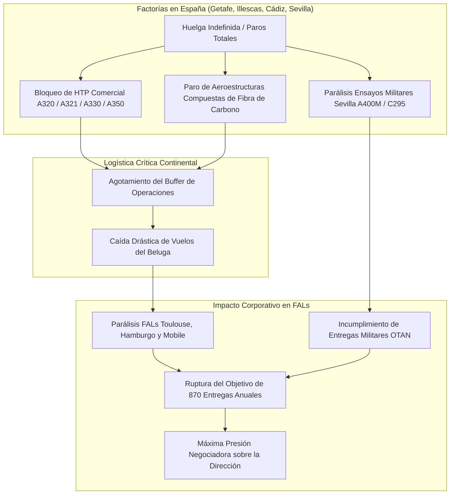
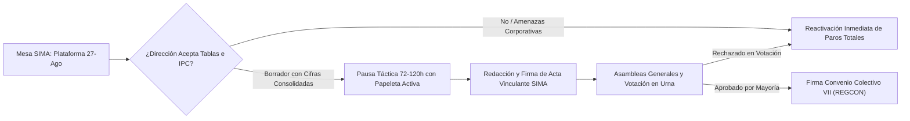
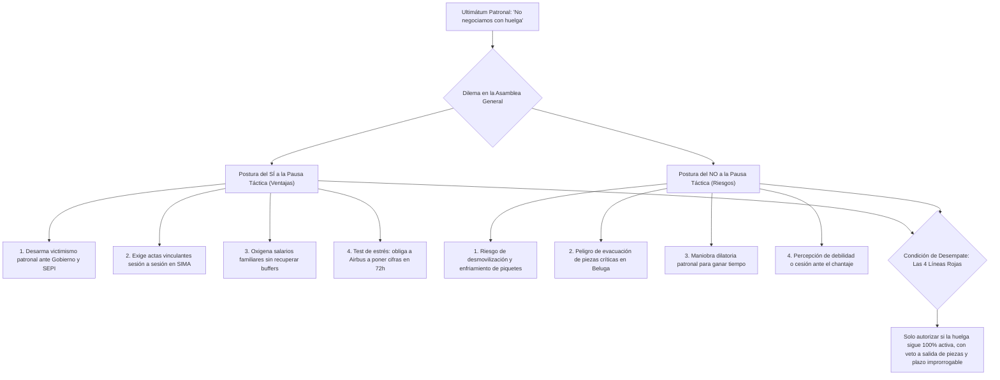
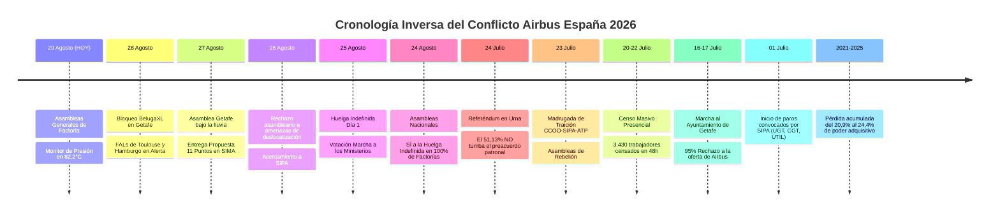

# GUÍA ESTRATÉGICA Y TÁCTICA DE NEGOCIACIÓN: HUELGA AIRBUS ESPAÑA 2026

**Documento Ejecutivo para la Acción Sindical, la Comisión Negociadora y la Plantilla**  
*Fuentes y referencias validadas: Actas de Mediación en el SIMA (Julio-Agosto 2026), Dossier de Recuperación del Poder Adquisitivo en Airbus España (Métricas INE, BdE, BCE), Propuesta del Comité de Huelga del 27/08/2026, V y VI Convenios Colectivos Interempresas (BOE), Informes Financieros Airbus SE (FY2024, FY2025 y H1-2026), Marco Normativo Laboral (Estatuto de los Trabajadores, RD-ley 17/1977, Ley 10/2021, Jurisprudencia del Tribunal Constitucional y Tribunal Supremo), Archivo Oficial del Canal de Telegram "EnfadadosconAirbus" (5.794 miembros) y Análisis de Casos Reales de Huelgas y Pausas Tácticas (Spirit AeroSystems 2023, RMT Network Rail 2022-2023, Metal de Cádiz 2021, Boeing IAM 751 2024, SNCF 2018, Acerinox 2024).*

---

## 1. Diagnóstico de Poder: La Ventaja Asimétrica de la Plantilla

Airbus opera bajo un modelo de producción transnacional altamente integrado y logística *just-in-time* (JIT). Esta arquitectura otorga a las factorías españolas (Getafe, Illescas, Cádiz y Sevilla) una capacidad de bloqueo estructural sobre el conjunto de las Líneas de Ensamblaje Final (FAL) europeas `[Dossier Estratégico Airbus España 2026, §1-2; McKinsey Commercial Aerospace Supply Chain Review 2025, p. 14-18]`:

1. **Monopolio Productivo del Estabilizador Horizontal (HTP):**
   * La factoría de Getafe ensambla y equipa en régimen de **proveedor único y exclusivo (*single-source*)** los HTP de **toda la familia de aviones comerciales de Airbus** (A320, A321XLR, A330 y A350/A350F) `[Dossier Estratégico 2026, §1.1; Airbus Operations Industrial Mapping, p. 8]`.
   * Las factorías de Illescas y Puerto Real/Cádiz fabrican en exclusiva aeroestructuras primarias de fibra de carbono y revestimientos alares esenciales `[Dossier Estratégico 2026, §1.2; Dossier Recuperación Salarial v8, Anexo B]`.
   * Con los inventarios de seguridad (*buffers*) de componentes agotados tras las jornadas de huelga acumuladas en julio, la paralización del suministro desde España detiene en cascada las FAL de Toulouse (Francia), Hamburgo (Alemania) y Mobile (EE.UU.) en un plazo crítico de **48 a 72 horas** `[Dossier Estratégico 2026, §1.4; IATA Aerospace Bottleneck Report 2025, p. 6]`.

2. **Vulnerabilidad Temporal: El Objetivo Anual de 870 Entregas:**
   * La dirección de Airbus SE se comprometió públicamente ante los mercados financieros a entregar **870 aeronaves comerciales en 2026** `[Airbus SE Annual Report 2025, Guidance 2026, p. 12; Airbus SE H1 2026 Results, p. 4]`.
   * Tras las 23 jornadas previas de paros en julio, el consorcio necesita mantener un ritmo sin precedentes de **90 entregas mensuales** durante el segundo semestre de 2026 para cumplir sus compromisos contractuales `[Acta SIMA 25/08/2026, Declaración Dirección RRHH; Airbus SE H1 2026 Interim Report, p. 7]`.
   * La interrupción de la producción en el tercer trimestre destruye la ventana operativa para recuperar el retraso acumulado, activando penalizaciones millonarias por demoras con aerolíneas clientes y amenazando la valoración bursátil de Airbus SE `[Dossier Estratégico 2026, §2.1; Annual Report 2025, Risk Factors, p. 45]`.

3. **Solvencia y Capacidad Financiera Récord:**
   * Airbus SE registró beneficios netos récord de **5.221 millones de euros en 2025** y **2.243 millones en el primer semestre de 2026**, manteniendo un elevado reparto de dividendos (2,80 €/acción) `[Airbus SE Financial Statements 2025, Consolidated Income Statement, p. 124; Airbus SE H1 2026 Financial Report, p. 3]`.
   * El coste anual total de la plataforma reivindicativa completa (subida salarial del 12%, fórmula IPC sin techo, 7.500 € de atrasos y blindajes sociales) representa menos del **2,8% del flujo de caja operativo anual** del grupo `[Dossier Recuperación Salarial v8, §5 "Capacidad Económica Airbus - Coste de Implementación", p. 18-22]`.

---

## 2. Histórico de Convenios Colectivos (BOE), Pérdidas Acumuladas y Traiciones de Despacho

### A. Los Convenios Colectivos Anteriores Publicados en el BOE y el Problema Estructural de la RSG

El origen de la depreciación salarial en Airbus España se encuentra en los pactos suscritos en los convenios colectivos anteriores, publicados oficialmente en el **Boletín Oficial del Estado (BOE)**:

1. **VI Convenio Colectivo Interempresas del Grupo Airbus (2020-2023 / Ultraactividad 2024-2025):**
   * **Publicación Oficial:** BOE núm. 297, de 11 de noviembre de 2021 (Resolución de la Dirección General de Trabajo / REGCON).
   * **Firmantes:** Dirección de Airbus, CCOO y ATP.
   * **Contenido Lesivo:** Estableció incrementos de Revisión Salarial General (RSG) fijos desvinculados del IPC real (1% en 2020, 1% en 2021, 1,5% en 2022 y 4,4% en 2023). Al estallar la crisis inflacionaria de 2021-2025 (+19,3% IPC general, +31,2% alimentos, +45% vivienda), las cláusulas de garantía resultaron totalmente ineficaces, provocando una **pérdida neta de poder adquisitivo del 20,9% al 24,4%**.
   * **El Método Bradford:** Durante la vigencia de este convenio, la dirección impuso unilateralmente la fórmula matemática de Bradford para recortar complementos de Incapacidad Temporal (IT) en bajas médicas justificadas, judicializando el conflicto.

2. **V Convenio Colectivo Interempresas de Airbus Group (2015-2019):**
   * **Publicación Oficial:** BOE núm. 165, de 10 de julio de 2015 (Código de Convenio n.º 90100062012014).
   * **Firmantes:** Dirección de Airbus, CCOO, SIPA y ATP.
   * **Contenido Lesivo:** Introdujo esquemas de moderación salarial justificados por la integración de estructuras y flexibilidad de turnos, sentando las bases de la absorción de complementos personales.

---

### B. Tabla de Pérdida Salarial Año a Año (2020 - 2025)

El estudio econométrico oficial del *Dossier de Recuperación Salarial (v8)*, basado en métricas del **INE (IPC, IPV y EPF 2025), Banco de España y BCE**, demuestra las cantidades brutas y netas dejadas de percibir por un trabajador tipo con salario base de 50.000 €:

| Año | Índice Coste Vida Real *(0,65·IPC + 0,35·IPV)* | Índice RSG Aplicada Airbus | Pérdida Nominal Bruta (€) | Pago Único Recibido (€) | Diferencia Neta Actualizada (€) | Diagnóstico Económico Oficial |
| :---: | :---: | :---: | :---: | :---: | :---: | :--- |
| **2020** | **100,0** *(Base)* | **100,0** | 0 € | 0 € | **0 €** | Año base normalizado (salario 50 K€). IPC: -0,5%, RSG: +1,0%. |
| **2021** | **106,5** | **101,0** | -2.735 € | +600 € | **-2.462 €** | Repunte inflacionario (+6,5%). Airbus solo aplica +1%. Pérdida bruta: -5,2%. |
| **2022** | **112,5** | **102,5** | -4.972 € | +1.500 € | **-3.788 €** | Crisis energética y alimentos (+15,7%). RSG en Airbus solo +1,5%. Pérdida: -8,9%. |
| **2023** | **116,4** | **107,0** | -4.677 € | +1.000 € | **-3.891 €** | Inflación persistente. RSG insuficiente (+4,4%). Pérdida bruta: -8,1%. |
| **2024** | **123,1** | **110,2** | -6.432 € | 0 € | **-6.617 €** | Coste de vida escala a 123,1 (+23,1%). Airbus aplica solo +3%. Pérdida: -10,5%. |
| **2025** | **131,0** | **112,5** | -9.269 € | 0 € | **-9.269 €** | Coste de vida en 131,0 (+31%). Alimentos +31,2%, Vivienda +45%. Pérdida neta: -17% a -24,4%. |
| **TOTAL** | **+31,0 % Acumulado** | **+12,5 % Acumulado** | **-28.085 €** | **+3.100 €** | **-26.030 €** | **PÉRDIDA TOTAL NETA: -26.030 € / TRABAJADOR (46,3% salario anual / 5,6 meses).** |

* **Masa Salarial Absorbida en España:** Para los 15.562 empleados de Airbus en España, las cantidades no percibidas equivalen a **405,1 millones de euros** retenidos por la multinacional.

---

### C. Registro de Pactos de Despacho y Traiciones de Madrugada

1. **La Traición de la Madrugada del 23 de Julio de 2026:**
   * **Los Hechos:** Tras 23 jornadas de paros masivos en julio y con el 95% de las asambleas rechazando la oferta de la empresa, las cúpulas de **CCOO, SIPA y ATP** firmaron a las 02:00 am un preacuerdo a espaldas de los huelguistas.
   * **El Contenido:** Aceptaba subidas fraccionadas del 5% en 2026 y 5% en abril de 2027 (con retardo de 4 meses), una paga única de solo 2.000 € en 2027 y revisión diferida a 2031 con techos de IPC. A cambio, acordaron desconvocar la huelga el 24 de julio para someter el pacto a referéndum.
   * **La Rebelión Asamblearia:** En la pre-asamblea de Getafe (08:50h) y asamblea general (10:00h), CGT y ÚTIL denunciaron el pacto. SIPA se vio forzada a comprometer la dimisión de su ejecutiva si las bases votaban NO.
   * **El Resultado del Referéndum (24 de julio):** Con un 81,44% de participación, **el 51,13% de la plantilla en urna TUMBÓ el preacuerdo**. La cúpula negociadora de SIPA dimitió en bloque y las bases retomaron el control del conflicto convocando la huelga indefinida para el 24/25 de agosto.

2. **La Imposición y Caída del Método Bradford en IT:**
   * La dirección recortó complementos salariales durante bajas médicas. Tras ser declarado nulo judicialmente, Airbus recurrió al Tribunal Supremo. La presión de la huelga indefinida forzó a Airbus en el SIMA (21-24 de agosto) a comprometer el desistimiento formal del recurso y la devolución de atrasos en nómina.

---

## 3. Evolución de las Negociaciones & Matriz de Brechas Actuales (Gap Analysis)

### A. La Plataforma Reivindicativa Inicial (1 de Julio de 2026)
Convocada por SIPA con el respaldo de UGT, CGT y ÚTIL, articuló 5 ejes esenciales:
1. **Recuperación Salarial:** Subida de IPC real + 10% en tablas entre 2026 y 2027.
2. **Teletrabajo Blindado:** Mínimo 40% (2 días/semana) con prórroga automática y sin recortes individuales.
3. **Salud Laboral e IT:** Retirada definitiva de la fórmula Bradford y devolución íntegra de salarios descontados.
4. **Proyecto Bromo (Espacio):** Blindaje estatutario para que el personal segregado permanezca bajo el Convenio de Airbus.
5. **Vacaciones Flexibles:** Dos semanas de descanso de libre elección individual.

---

### B. Evolución de Propuestas en Fechas Clave

* **16 de Julio de 2026 (Oferta de Cierre Patronal tras cita con Faury):** 5% en 2026 y 5% en 2027 (desde abril). Si IPC supera el 10%, comisión no vinculante. $\rightarrow$ **Rechazo del 95% en asambleas estatales el 17/07.**
* **23-24 de Julio de 2026 (Preacuerdo de Cúpulas):** CCOO/SIPA/ATP pactan 12% global hasta 2027 + 2.000 € en 2027 con techos. $\rightarrow$ **Tumbado en referéndum por el 51,13% NO.**
* **20-21 de Agosto de 2026 (SIMA previo a Huelga Indefinida):** Oferta patronal de 7,6% a 5 años (hasta 2030) y desistimiento en Bradford. $\rightarrow$ **Rechazado en asambleas del 24/08: SÍ masivo a la huelga indefinida.**
* **25 de Agosto de 2026 (Huelga Día 1):** Amenazas de Carmen-Maja Rex de congelar contrataciones y deslocalizar carga. $\rightarrow$ **Rechazo unánime asambleario y aprobación de Marcha a los Ministerios.**
* **27 de Agosto de 2026 (Propuesta Cuantificada del Comité de Huelga):** Entrega de los 11 puntos: 12% directo en tablas a 1/1/2026, 7.500 € atrasos, RSG = IPC+1,5% sin techo y 100% de días de huelga.

---

### C. Matriz Comparativa Punto por Punto: Comité de Huelga vs. Dirección de Airbus (SIMA 27/08/2026)

| Materia Negociada | Posición Comité de Huelga (UGT/CGT/ÚTIL) | Posición Dirección Airbus SE | Brecha Directa (*Gap*) | Estatus / Línea Roja |
| :--- | :--- | :--- | :--- | :---: |
| **1. Incremento en Salario Base (Tablas)** | **+12% directo e inmediato** en tablas a 1 de enero de 2026. | **+5% fraccionado** (efecto abril) o 7,6% en 5 años (a 2030). | **Brecha de 7,0 puntos porcentuales** en salario consolidable. | 🔴 **Línea Roja Crítica** |
| **2. Paga Única de Atrasos (2020-2025)** | Abono extraordinario de **7.500 €** no consolidable. | Paga única de **2.000 € brutos** aplazada a abril de 2027. | **Diferencia de 5.500 €** directos por trabajador. | 🔴 **Línea Roja Financiera** |
| **3. Cláusula de Revisión Salarial (RSG)** | **RSG = IPC real + 1,5%** anual sin topes (*cap*) y suelo 0%. | Vinculación a IPC con **techo máximo (*cap*) del 4%**. | Riesgo de nueva devaluación salarial si repunta inflación. | 🔵 **Blindaje Técnico** |
| **4. Horizonte Temporal del Convenio** | **Marco acotado a 2 años** (2026-2027). | **Marco de 5 años** (2026-2030) diferido. | Diferencia de 3 años de hipoteca contractual. | 🔴 **Línea Roja Temporal** |
| **5. Régimen de Teletrabajo** | Mínimo **40% (2 días)** blindado por convenio colectivo. | 2 días en acuerdos individuales verbales revocables. | Falta de garantía estatutaria frente a cambios de RRHH. | 🟡 **Línea Roja Social** |
| **6. Salud Laboral (Bradford)** | Retirada definitiva e ingreso de atrasos en **octubre 2026**. | Desistimiento del recurso en TS y pago diferido. | Concreción de plazos de liquidación en nómina. | 🟢 **Acercamiento Condicionado** |
| **7. Garantías Proyecto Bromo** | Aplicación VIII Convenio, 6 años de empleo y retorno. | Convenio de origen condicionado y bolsa de movilidad. | Aval solidario de matriz Airbus contra despidos. | 🔴 **Línea Roja Empleo** |
| **8. Días de Huelga y Paz Social** | **100% de abono** de jornadas y huelga activa en SIMA. | Exige desconvocatoria previa para entregar textos. | Bloqueo táctico: asambleas rechazan parar sin cifras. | 🔴 **Punto de Máxima Tensión** |

---

## 4. Cómo Avanzar en la Negociación: Estrategia y Justificación del Parón Táctico

### A. Soberanía Asamblearia y Frente Único de Negociación
* **Ratificación vinculante en urnas:** Ningún principio de acuerdo suscrito en el SIMA tendrá validez definitiva sin la aprobación mayoritaria de la plantilla en asambleas generales con voto secreto (lección del 24 de julio).
* **Unidad de la Comisión Negociadora del Convenio (CNC):** Exigir que todas las secciones sindicales actúen con una portavocía unificada basada en la plataforma del 27 de agosto.

---

### B. El Dilema del Parón: Análisis Dialéctico de la Pausa Táctica

1. **La Desconvocatoria Total (Trampa Letal - RECHAZO ABSOLUTO):**
   * Desconvocar formalmente extingue el marco legal del conflicto.
   * Conforme al RD-ley 17/1977 (Art. 4), volver a convocar exige **5 días de preaviso ordinario** (y 10 días en defensa) más nueva mediación en el SIMA. Durante esa ventana forzosa, Airbus evacuaría piezas en los Beluga y rellenaría los almacenes de Toulouse y Hamburgo.

2. **La Suspensión Temporal Condicionada o "Pausa Táctica" de 72-120h (Art. 8.2 RD-ley 17/1977):**
   * La convocatoria de huelga indefinida **se mantiene 100% registrada, legalmente válida y activa**.
   * El Comité de Huelga únicamente congela transitoriamente la ejecución de los paros durante un plazo estricto de **3 a 5 días laborables (72h a 120h)** supeditado de forma exclusiva a la mesa del SIMA.

---

## 5. Casos Reales Comparados y Desmontaje de Amenazas

| Caso / Conflicto Real | Año y Sector | Táctica Empleada | ¿Éxito o Fracaso? | Causa Clave del Resultado | Lección Directa para Airbus España 2026 |
| :--- | :---: | :--- | :---: | :--- | :--- |
| **Spirit AeroSystems (IAM 839)** | 2023 (Aeroespacial, Wichita) | Paro total de 4 días tras rechazar oferta del 16% por 79%; mediación federal FMCS. | **ÉXITO** | Bloqueo a Boeing y Airbus a la vez forzó a capitular a la patronal en 72 horas. | **Golpear cuellos de botella neurálgicos (HTP en Getafe) fuerza acuerdos rápidos.** |
| **RMT Network Rail** | 2022–2023 (Ferrocarril, UK) | Paros de 48h alternados con pausas técnicas sin retirar papeleta. | **ÉXITO** | Se preservó la economía familiar y se forzó subida del 9% al 14% con blindaje de empleo. | **La pausa táctica de 72-120h oxigena a la plantilla sin perder la amenaza legal.** |
| **Metal de Cádiz** | 2021 (Industria del Metal) | Huelga indefinida de 9 días con bloqueo total; mediación en CARL/SIMA. | **ÉXITO** | Unidad sindical y control de accesos forzaron subida en tablas y cláusula de IPC real. | **La unidad de la CNC y el control de accesos son indispensables.** |
| **Boeing (IAM 751)** | 2024 (Aeroespacial, Seattle) | Huelga continua de 53 días rechazando 25% y 35% en urnas hasta lograr el 38%. | **ÉXITO** | Soberanía asamblearia impidió preacuerdos a la baja. | **La ratificación obligatoria en urnas es el único dique contra pactos regresivos.** |
| **SNCF (*Grève Perlée*)** | 2018 (Ferrocarril, Francia) | Calendario fijo de "2 días de huelga cada 5" durante 3 meses. | **FRACASO** | La previsibilidad permitió a la empresa reorganizar suministros y desgastar nóminas. | **NUNCA pactar calendarios de paros previsibles a largo plazo.** |
| **Acerinox Palmones** | 2024 (Siderurgia, Cádiz) | Huelga lineal ininterrumpida de 135 días sin pausas ni caja de resistencia. | **FRACASO** | Asfixia financiera de las familias tras 4 meses sin sueldo; fractura sindical y ERE. | **El desgaste lineal prolongado sin modulación destruye la resistencia.** |

---

## 6. Línea Temporal Inversa & Minutas Detalladas de Asambleas de Fábrica (Presente HOY $\rightarrow$ Pasado 2021)

### Registro Exhaustivo de Asambleas y Resoluciones

1. **29 de agosto de 2026 (HOY):** Asambleas generales informativas en Getafe (Puerta Sur/Norte), San Pablo, Tablada, Illescas, Albacete y Cádiz. El Comité de Huelga ratifica el mandato de no votar ninguna propuesta que no supere los 6 Filtros Innegociables. El Termómetro de Presión alcanza los 82.2°C.
2. **28 de agosto de 2026:** Bloqueo absoluto de vuelos BelugaXL en Getafe (LEGT). Cero vuelos operados. El 100% de los HTP de A320/A321/A350 retenidos. Alerta roja en FALs de Toulouse y Hamburgo.
3. **27 de agosto de 2026 (Getafe Puerta Sur, 09:30h):** Huelga Día 3 bajo la lluvia. Entrega formal en el SIMA de la propuesta de 11 puntos (12% en tablas a 1/1/2026, 7.500 € atrasos, IPC+1,5% sin techo). Aprobado enviar carta factual al Gobierno de España denunciando coacciones.
4. **26 de agosto de 2026 (Getafe Puerta Norte, 10:00h):** Huelga Día 2. Se informa de las amenazas de Carmen-Maja Rex (congelación de contrataciones y deslocalización). Votación: Aprobado por mayoría absoluta repudiar las amenazas y adelantar asambleas a las 09:30h. Acercamiento formal a SIPA.
5. **25 de agosto de 2026 (Getafe Puerta Sur, 10:00h):** Huelga Día 1. Entre 1.200 y 2.000 trabajadores. Buffers de componentes de Operaciones agotados (parada de FAL A330). Votación: Aprobado organizar y financiar la Marcha a los Ministerios en Madrid con autobuses intercentros (San Pablo vota SÍ).
6. **24 de agosto de 2026 (Asambleas Nacionales de Factoría):** Getafe (05:30h A5, 11:30h explanada P1-A1, 18:00h), San Pablo (10:00h Comedor Sur, 18:00h), Tablada (12:00h Salón Actos, 18:00h), Illescas (10:35h Autoclaves, 18:35h), Albacete (10:00h Edificio A, 17:00h). Informe del SIMA del 21/08 (compromiso de retirar Bradford). Votación: **Gana por Mayoría Absoluta el SÍ A LA HUELGA INDEFINIDA**.
7. **29 de julio de 2026 (Getafe Puerta Norte, 09:51h):** Asamblea retribuida. Presentación formal de la papeleta de huelga indefinida registrada por CGT, ÚTIL y UGT para el regreso de vacaciones. Aprobado mantener fecha del 24 de agosto.
8. **24 de julio de 2026 (Referéndum General en Urna):** Participación masiva del 81,44%. **Votos NO: 51,13%** (49,15% del censo total) vs. Votos SÍ: 48,87%. El preacuerdo patronal de CCOO-SIPA-ATP es TUMBADO en las urnas. Dimisión de la cúpula de SIPA.
9. **23 de julio de 2026 (Getafe Puerta Sur, Pre-asamblea 08:50h / Asamblea 10:00h):** Indignación tras la firma de madrugada del preacuerdo. CGT y ÚTIL denuncian la traición de la mesa; SIPA compromete dimisiones si sale NO. La asamblea vota acudir en masa a las urnas a votar NO.
10. **22 de julio de 2026 (Getafe Puerta Norte, 10:00h):** Confirmación de que Tablada, San Pablo e Illescas apoyan la papeleta. Presentación del manifiesto conjunto de 5 sindicatos. Aprobado mantener asambleas a las 10:00h.
11. **21 de julio de 2026 (Getafe Puerta Sur, 10:00h):** Votación de la papeleta de huelga indefinida desde el 24 de agosto. Censo acumulado: 3.430 trabajadores censados en 48h (Getafe 1.921, San Pablo 724, Illescas 362, Tablada 263, Albacete 160).
12. **20 de julio de 2026 (Getafe Puerta Norte, 10:00h):** Despliegue del censo presencial con badge y número Z (1.727 censados en día 1). Presentación del dossier financiero y canal Telegram. Aprobado presentar papeleta sin valores numéricos fijos cerrados.
13. **17 de julio de 2026 (Asambleas Estatales Simultáneas, 09:00h - 11:00h):** Paradas operativas en Marignane y parada de vuelos Beluga a Toulouse. Votación a las 10:30h: **Rechazo rotundo (~95% NO)** a la oferta del 16 de julio. Constitución de Comité de Huelga de 10 miembros.
14. **16 de julio de 2026 (Getafe Puerta Norte, 10:00h):** Marcha masiva al Ayuntamiento de Getafe y recepción por la alcaldesa. Intervención de Nacho Abascal (portavoz San Pablo) proclamando que "el punto de ruptura de la empresa está cerca".
15. **14 de julio de 2026 (Tablada Sevilla, 06:00h):** Constitución de 4 grupos de trabajo autogestionados y enlace con San Pablo para la "voz común de Sevilla".
16. **1 de julio de 2026:** Estallido de los primeros paros convocados por SIPA con apoyo de UGT, CGT y ÚTIL.
17. **2021 - 2025 (Causa Raíz):** Pérdida acumulada del 20,9% al 24,4% de poder adquisitivo real por brecha entre el VI Convenio y la inflación oficial.

---

## 7. Checklist de Verificación para la Asamblea General (Auditor 6 Filtros)

Antes de emitir el voto favorable en urna para ratificar el Convenio Colectivo VII, la plantilla debe verificar que el texto final cumpla íntegramente los siguientes **6 filtros innegociables**:

- [ ] **1. Consolidación Salarial en Tablas:** ¿El incremento salarial (12% retroactivo a 1 de enero de 2026) se aplica íntegramente sobre las tablas de 2025 y forma parte de la masa salarial fija consolidada (sin complementos absorbibles)?
- [ ] **2. Cláusula de Revisión Salarial sin Techo:** ¿La fórmula de revisión anual (**RSG = IPC + 1,5%**) carece de cláusula tope (*cap* del 4%) y cuenta con cláusula suelo del 0%?
- [ ] **3. Teletrabajo Universal y Blindado:** ¿Se reconoce por escrito el derecho al 40% de la jornada (2 días semanales) con reversibilidad exclusiva a criterio de la persona trabajadora y prórroga automática?
- [ ] **4. Devolución de Descuentos por IT (Bradford):** ¿Figura de forma explícita el abono en nómina de todas las cantidades descontadas indebidamente por Incapacidad Temporal?
- [ ] **5. Blindaje del Proyecto Bromo (Espacio):** ¿Están recogidas la subrogación (Art. 44.1 ET), la vinculación al Convenio de Airbus, la prohibición de doble escala salarial y el derecho de retorno al Grupo durante 6 años?
- [ ] **6. Cláusula de Paz Social y Garantía de Indemnidad:** ¿La desconvocatoria definitiva de la huelga queda condicionada a la inscripción oficial en el REGCON, asegurando la no adopción de represalias y la compensación de días de huelga?

---

## 8. Descargas Directas, Archivo de Telegram y Fuentes Primarias

Para facilitar el acceso y la transparencia informativa, toda la documentación oficial, datasets y archivos del canal de Telegram están disponibles para su descarga directa:

### A. Enlaces de Descarga Directa
* 📄 **Guía Oficial en PDF (8 páginas maquetadas A4):** `docs/Guia_Estrategica_Negociacion_Huelga_Airbus_2026.pdf`
* 📝 **Guía Completa en Formato Markdown:** `docs/Guia_Estrategica_Negociacion_Huelga_Airbus_2026.md`
* 📊 **Dataset Analítico Consolidado (JSON):** `data/conflict_metrics.json`
* 📲 **Índice del Archivo Telegram "EnfadadosconAirbus" (JSON):** `data/telegram_archive/telegram_index.json`
* ✈️ **Monitor de Vuelos BelugaXL en Vivo (JSON):** `data/beluga_status.json`
* 🌡️ **Feed de Presión Mediática y Noticias (JSON):** `data/thermometer_data.json`

### B. Repositorio Documental y Canal de Telegram
* **Canal Oficial de Asambleas:** `https://t.me/+MnuqJDCAAgYyMGQ0` (*5.794 miembros activos*)
* **Panel Web Interactivo en Vivo:** `https://sergiomh499.github.io/airbus-strikes-analysis/`
* **Código Fuente y Automatización:** `https://github.com/sergiomh499/airbus-strikes-analysis`
