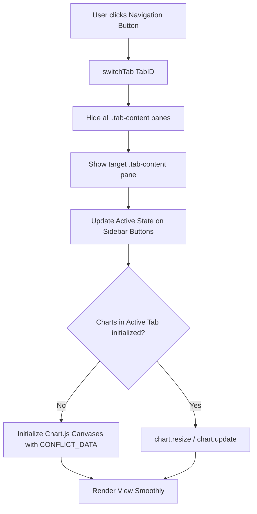

# Data Model & UI Component Mappings: Dashboard UI/UX Simplification

**Feature Branch**: `003-simplify-dashboard`
**Date**: 2026-08-31

---

## 1. Top-Level Thematic Navigation Model

```yaml
ThematicModules:
  - id: tab-overview
    title: "1. Centro de Mando & Asimetría"
    icon: "layout-dashboard"
    badge: null
    components:
      - QuickKPIGrid: [TotalWorkers, PlatformCost, EBITShare, CapitalLossRatio]
      - AsymmetryVisualCard: [122.5x Ratio, AsymmetryChart]
      - StockMarketPanel: [CurrentPrice, MarketCap, DailyHistoryMilestones, AirbusStockChart]
      - CompanyHealthPanel: [Revenue, EBIT, NetProfit, Backlog, SolvencyRatio, CompanyRevenueChart, CompanyDeliveriesChart, ShareholderPieChart]

  - id: tab-industrial
    title: "2. Impacto Industrial & Logística"
    icon: "boxes"
    badge: "85.5°C"
    badge_style: "bg-rose-500/20 text-rose-300 border-rose-500/30"
    components:
      - SupplyChainBufferCard: [GetafeHTP, IllescasEmpennages, FALsToulouse, FALsHamburg]
      - BelugaLiveMonitor: [DailyFlights, SuspendedMissions, BottleneckAlerts, BelugaHistoryChart]
      - ConflictThermometer: [SocialTemperatureGauge, PlantPressureIndex, AssemblyActivityLog]

  - id: tab-purchasing-power
    title: "3. Poder Adquisitivo & Negociación"
    icon: "calculator"
    badge: "-26.027 €"
    badge_style: "bg-rose-500/20 text-rose-300 border-rose-500/30"
    components:
      - WageLossSimulator: [SalarySlider, InflationSlider, NetLossOutput, WagesChart]
      - HistoricalLossesTable: [YearlyLossMetrics2020_2025, CumulativeDeficit]
      - OfferGapAnalysisCard: [CompanyOfferVsUnionPlatform, ConsolidableTablesComparison]
      - UnionPlatform11Points: [11PlatformDemands, LegalFrameworkLinks]

  - id: tab-union-force
    title: "4. Fuerza Sindical & Asamblea"
    icon: "users"
    badge: "198 del."
    badge_style: "bg-amber-500/20 text-amber-300 border-amber-500/30"
    components:
      - DelegateMatrixPanel: [PlantByPlantCensus, 198DelegatesByUnion, SiteDelegatesChart, UnionShareChart, UnionEvolutionChart]
      - Referendum24JResults: [StatewideTotals, PlantByPlantBreakdown, ReferendumPieChart, ReferendumSitesChart]
      - AssemblyTimelineChronology: [18MilestoneAssemblies, PresentToPast]
      - ScenarioDecisionTrees: [ProbabilisticResolutionWorkflows]

  - id: tab-evidence
    title: "5. Documentación & Evidencias"
    icon: "book-open"
    badge: "269 doc."
    badge_style: "bg-sky-500/20 text-sky-300 border-sky-500/30"
    components:
      - DocumentaryAnnex: [269IndexedPrimarySources, SearchFilter, DirectLinks]
      - TelegramArchive: [5794Members, OfficialAssemblyMinutes, FactoryBulletins]
      - StrategicBenchmarks: [8AerospaceLaborStrikes, ComparativeTables]
```

---

## 2. Component Lifecycle & Chart.js Lazy Rendering


