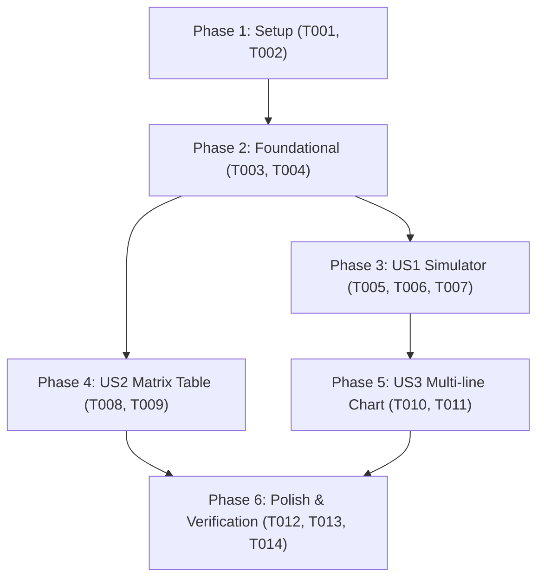

# Tasks: Comparativa de Evolución Salarial Bruta Anual y Análisis Exhaustivo de Propuestas

**Input**: Design documents from `/specs/008-compare-salary-proposals/` (`spec.md`, `plan.md`, `research.md`, `data-model.md`, `contracts/`, `quickstart.md`)

**Prerequisites**: `plan.md` (required), `spec.md` (required for user stories), `research.md`, `data-model.md`, `contracts/`

**Organization**: Tasks are grouped by user story to enable independent implementation and testing of each story.

## Format: `[ID] [P?] [Story] Description`

- **[P]**: Can run in parallel (different files, no dependencies)
- **[Story]**: Which user story this task belongs to (`[US1]`, `[US2]`, `[US3]`)
- Exact file paths included in all task descriptions

---

## Phase 1: Setup (Data Schema & Canonical Fixtures)

**Purpose**: Update canonical datasets and fallback fixtures with the 3 bargaining proposals and 10-dimension comparison matrix.

- [x] T001 Define and populate canonical proposal structures and 10-dimension comparison matrix in `data/conflict_metrics.json`
- [x] T002 [P] Synchronize fallback proposal fixtures and schema definitions in `dashboard/data.js`

---

## Phase 2: Foundational (Backend Analytical Engine & Invariants)

**Purpose**: Core calculation engine in Python that MUST be complete before UI reactivity and verification can proceed.

- [x] T003 Implement `get_salary_proposals_comparison(base_salary, cpi_rate)` in `src/analysis_engine.py`
- [x] T004 [P] Add unit tests for 3-way proposal calculations, year-by-year projections, and invariants in `tests/test_analysis_engine.py`

**Checkpoint**: Foundation ready - Python calculations verified against mathematical formulas in `research.md`.

---

## Phase 3: User Story 1 - Multi-Proposal Gross Annual Wage Evolution Simulator (Priority: P1) 🎯 MVP

**Goal**: Workers can interactively simulate the 5-year gross salary trajectory across Company, CGT, and Strike Committee proposals for any base salary.

**Independent Test**: Adjust salary slider in dashboard and verify that nominal and real year-by-year tables dynamically compute values for all 3 proposals.

### Implementation for User Story 1

- [x] T005 [P] [US1] Implement client-side `calculateSalaryProposals(baseSalary, ipcRate)` in `dashboard/app.js`
- [x] T006 [US1] Update Module 3 (`#tab-purchasing-power`) HTML in `dashboard/index.html` with 3-proposal comparison table rows
- [x] T007 [US1] Bind salary and inflation slider events to update 3-way projection values in `dashboard/app.js` (`updateWageSimulation`)

**Checkpoint**: At this point, User Story 1 (MVP) is fully functional and delivers the core interactive salary comparison.

---

## Phase 4: User Story 2 - Comprehensive Point-by-Point Proposal Breakdown & Difference Matrix (Priority: P2)

**Goal**: Provide an exhaustive 10-dimension comparative matrix contrasting Company, CGT, and Strike Committee positions with primary sources and submission dates.

**Independent Test**: Navigate to the proposal breakdown section and verify that all 10 bargaining dimensions render with proper badges and citations.

### Implementation for User Story 2

- [x] T008 [P] [US2] Add the HTML container structure for the 10-dimension point-by-point matrix in `dashboard/index.html`
- [x] T009 [US2] Implement `renderSalaryProposalsMatrix()` in `dashboard/app.js` to dynamically inject the comparison matrix table

**Checkpoint**: User Stories 1 AND 2 are functional, providing both quantitative numbers and qualitative clause analysis.

---

## Phase 5: User Story 3 - Interactive Proposal Selector & Visual Differential Chart (Priority: P3)

**Goal**: Multi-line Chart.js visualization with 4 series (CGT, Strike Committee, Airbus SE, and Real CPI Baseline) plus differential delta cards.

**Independent Test**: Inspect `wagesChart` canvas and confirm all 4 datasets render distinct colors and accurate tooltips.

### Implementation for User Story 3

- [x] T010 [P] [US3] Update `initWagesChart()` and `updateWagesChart()` in `dashboard/app.js` to render all 4 datasets with distinct styles
- [x] T011 [US3] Add 5-year cumulative differential KPI summary cards in `dashboard/index.html` comparing net gains vs. Airbus SE offer

**Checkpoint**: All user stories functional with full numerical, tabular, and graphical parity.

---

## Phase 6: Polish & Cross-Cutting Verification

**Purpose**: Invariant testing, DOM validation, and documentation.

- [x] T012 [P] Add DOM structure and UI assertion tests for proposal elements in `tests/test_dashboard_ui.py`
- [x] T013 Run `python3 src/validate_invariants.py` and `python3 src/validate_sources.py` to ensure 100% invariant and DOM compliance
- [x] T014 Execute quickstart validation scenarios and document changes in `CHANGELOG.md`

---

## Dependencies & Execution Order

### Parallel Opportunities

- `T001` and `T002` can run in parallel (data files).
- `T003` and `T004` (tests) can run in parallel.
- `T005` (JS math) and `T008` (HTML matrix layout) can run in parallel.
- `T010` (Chart.js update) and `T012` (DOM UI tests) can run in parallel.

---

## Implementation Strategy (MVP First)

1. **Phase 1 & 2**: Update `conflict_metrics.json`, `data.js`, and `analysis_engine.py`.
2. **Phase 3 (MVP)**: Implement `calculateSalaryProposals` and connect table rows in `app.js` / `index.html`.
3. **Phase 4**: Add the 10-dimension comparison matrix table.
4. **Phase 5**: Update `wagesChart` datasets and differential cards.
5. **Phase 6**: Run complete test suite and invariant validators.
