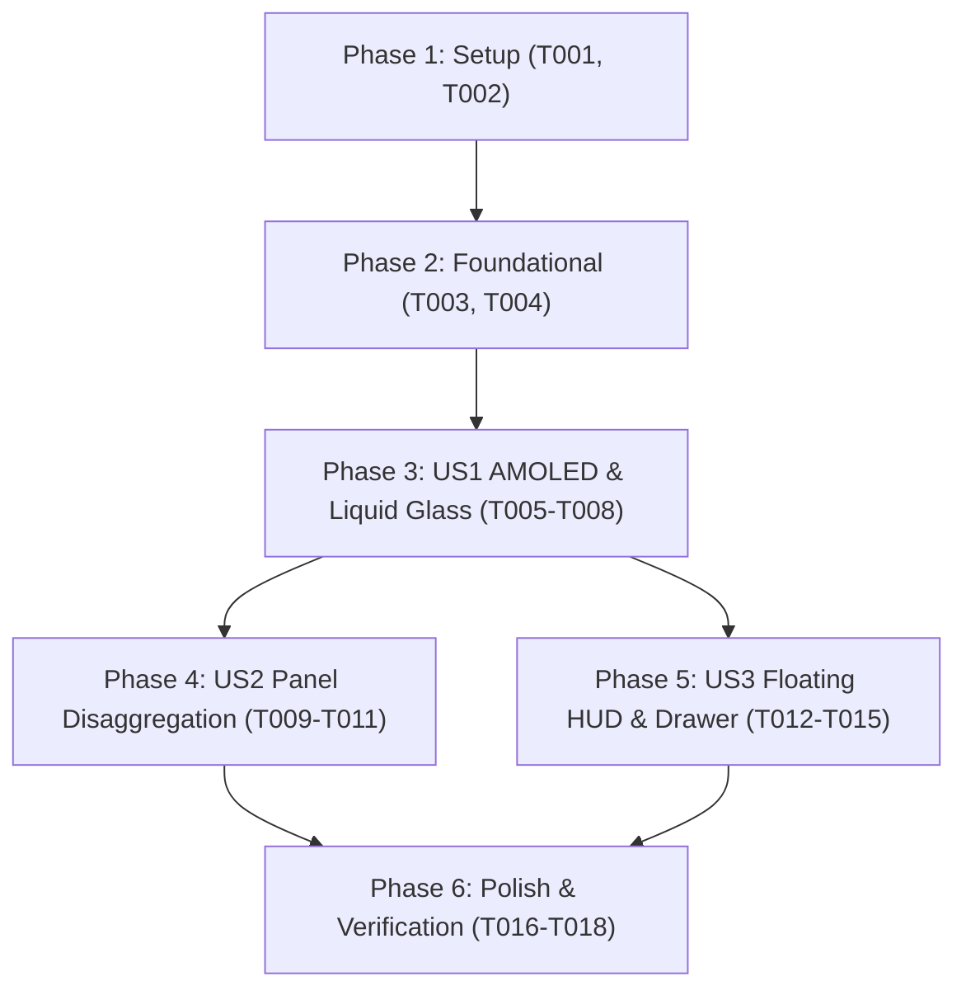

# Tasks: Rediseño Visual y Experiencia de Usuario "Liquid Crystal" & AMOLED Black

**Input**: Design documents from `/specs/009-liquid-glass-ui-redesign/` (`spec.md`, `plan.md`, `research.md`, `data-model.md`, `contracts/`, `quickstart.md`)

**Prerequisites**: `plan.md` (required), `spec.md` (required for user stories), `research.md`, `data-model.md`, `contracts/`

**Organization**: Tasks are grouped by user story to enable independent implementation and testing of each story.

## Format: `[ID] [P?] [Story] Description`

- **[P]**: Can run in parallel (different files, no dependencies)
- **[Story]**: Which user story this task belongs to (`[US1]`, `[US2]`, `[US3]`)
- Exact file paths included in all task descriptions

---

## Phase 1: Setup (Design Tokens & Typography Stack)

**Purpose**: Establish AMOLED Black base tokens, Liquid Crystal CSS variables, and modern aesthetic typography stack.

- [ ] T001 Configure AMOLED black theme variables, custom typography fonts (Geist Sans, Inter Display, JetBrains Mono) CDN links, and local fallbacks in `dashboard/index.html`
- [ ] T002 [P] Define Liquid Crystal Glassmorphism 2.0 CSS utility classes, specular reflection borders, and micro-glow tokens in `dashboard/index.html`

---

## Phase 2: Foundational (Chart.js Dark Theme & Base Lifecycle)

**Purpose**: Re-align Chart.js styling with AMOLED liquid dark palette and verify base viewport lifecycle contracts.

- [ ] T003 Update Chart.js dark-theme defaults (grid lines, ticks, glassmorphic tooltips) and preserve instant zero-delay rendering in `dashboard/app.js`
- [ ] T004 [P] Add base UI layout and typography regression test assertions in `tests/test_dashboard_ui.py`

**Checkpoint**: Foundation ready - Theme variables, CSS utilities, and dark chart configurations verified.

---

## Phase 3: User Story 1 - AMOLED Black & Liquid Crystal Visual Overhaul (Priority: P1) 🎯 MVP

**Goal**: Full visual makeover transforming all cards and background into AMOLED Black `#000000` with high-fidelity Liquid Crystal translucency and aesthetic tabular typography.

**Independent Test**: Load `dashboard/index.html` in browser and confirm `#000000` background, `backdrop-filter: blur(24px)` glass cards with specular highlight borders, and tabular figures across all 6 tabs.

### Implementation for User Story 1

- [ ] T005 [P] [US1] Transform base background and header card styling to pure AMOLED black `#000000` with specular glass reflection in `dashboard/index.html`
- [ ] T006 [US1] Apply Liquid Crystal styling (`backdrop-filter: blur(24px)`) and tabular font alignment to all primary cards across Tab 0 and Tab 1 in `dashboard/index.html`
- [ ] T007 [US1] Apply Liquid Crystal styling and high-contrast telemetry glow badges across Tab 2 and Tab 4 in `dashboard/index.html`
- [ ] T008 [US1] Apply Liquid Crystal styling and tabular figures to Tab 3 (Purchasing Power & SIMA) and Tab 5 (Document Archive) in `dashboard/index.html`

**Checkpoint**: User Story 1 (MVP) is complete and delivers the full AMOLED Liquid Crystal aesthetic transformation.

---

## Phase 4: User Story 2 - Panel Re-Architecture & Spatial Disaggregation (Priority: P2)

**Goal**: Disaggregate overloaded cards into clean atomic visual modules with generous 8pt grid padding (`gap-6` to `gap-8`) and clear visual hierarchy.

**Independent Test**: Navigate through all 6 tabs and verify that panels have distinct breathing room, structured sub-panels, and zero cramped layouts.

### Implementation for User Story 2

- [ ] T009 [P] [US2] Re-structure Tab 0 (Portal Hub) with decoupled atomic glass cards, generous 8pt grid padding, and glowing visual access portals in `dashboard/index.html`
- [ ] T010 [US2] Re-structure Tab 1 (Financial Center) into 3 distinct visual zones (Corporate profit, stock crater, platform cost) with breathing room in `dashboard/index.html`
- [ ] T011 [US2] Re-structure Tab 3 (Purchasing Power) with side-by-side decoupled simulator controls and floating KPI summary cards in `dashboard/index.html`

**Checkpoint**: User Stories 1 AND 2 are complete, providing both high-end aesthetics and clean spatial architecture.

---

## Phase 5: User Story 3 - Floating HUD, Contextual Drawer & Micro-Interactions (Priority: P3)

**Goal**: Introduce floating contextual UI elements (Dynamic Island HUD, Quick Calculator Drawer, and Back-to-Top button) for enhanced interactivity.

**Independent Test**: Scroll down in any long view and confirm Dynamic Island appears, click quick calculator to slide out drawer, test live slider recalculation, and verify scroll reset to top on tab change.

### Implementation for User Story 3

- [ ] T012 [P] [US3] Add HTML markup for Dynamic Island (`#floating-hud`), Quick Calculator Drawer (`#quick-calc-drawer`), and Back-to-Top button in `dashboard/index.html`
- [ ] T013 [US3] Implement `initFloatingHUD()` with scroll listener, module shortcuts, and dynamic metric counters in `dashboard/app.js`
- [ ] T014 [US3] Implement `toggleQuickCalculatorDrawer()` and `syncDrawerWithMainSimulator()` with two-way slider reactivity in `dashboard/app.js`
- [ ] T015 [US3] Ensure Principle VI compliance (`scrollTop = 0` and `.resize()` triggers) across all floating navigation elements in `dashboard/app.js`

**Checkpoint**: All user stories functional with full aesthetic, structural, and interactive capabilities.

---

## Phase 6: Polish & Cross-Cutting Verification

**Purpose**: DOM validation, automated invariant checks, and changelog documentation.

- [ ] T016 [P] Add DOM and interaction assertion tests for `#floating-hud` and `#quick-calc-drawer` in `tests/test_dashboard_ui.py`
- [ ] T017 Run `python3 src/validate_sources.py` and `python3 src/validate_invariants.py` ensuring 100% tag balance and invariant compliance
- [ ] T018 Execute browser quickstart validation scenarios and document changes in `CHANGELOG.md`

---

## Dependencies & Execution Order

### Parallel Opportunities

- `T001` and `T002` can run in parallel.
- `T003` (JS chart theme) and `T004` (UI test assertions) can run in parallel.
- `T009` (Tab 0 re-architecture) and `T012` (Floating HUD HTML) can run in parallel.
- `T016` (DOM UI tests) and `T017` (Source validators) can run in parallel.

---

## Implementation Strategy (MVP First)

1. **Phase 1 & 2**: Establish tokens, fonts, and dark chart themes.
2. **Phase 3 (MVP)**: Deliver the full AMOLED `#000000` and Liquid Crystal styling across all cards.
3. **Phase 4**: Re-organize panel layouts and information density.
4. **Phase 5**: Wire Dynamic Island HUD and Quick Calculator Drawer.
5. **Phase 6**: Execute automated test suite and quickstart scenarios.
