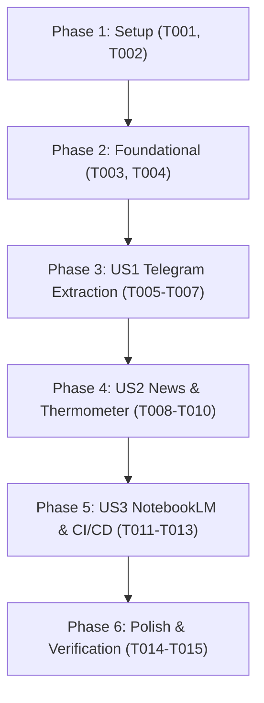

# Tasks: Sincronización Integral de Telegram, Noticias/Redes y NotebookLM

**Input**: Design documents from `/specs/010-sync-telegram-news-notebooklm/` (`spec.md`, `plan.md`, `research.md`, `data-model.md`, `contracts/`, `quickstart.md`)

**Prerequisites**: `plan.md` (required), `spec.md` (required for user stories), `research.md`, `data-model.md`, `contracts/`

**Organization**: Tasks are grouped by user story to enable independent implementation and testing of each story.

## Format: `[ID] [P?] [Story] Description`

- **[P]**: Can run in parallel (different files, no dependencies)
- **[Story]**: Which user story this task belongs to (`[US1]`, `[US2]`, `[US3]`)
- Exact file paths included in all task descriptions

---

## Phase 1: Setup (Directory Structure & Environment Configuration)

**Purpose**: Establish target directory structure, `.gitkeep` anchors, and initial state schemas.

- [ ] T001 Ensure `data/telegram_archive/` subdirectories (`assembly_minutes/`, `legal_filings/`, `dossiers/`, `documents/`) exist with appropriate `.gitkeep` files
- [ ] T002 [P] Initialize and verify baseline structure of `data/sync_status.json` adhering to `specs/010-sync-telegram-news-notebooklm/contracts/sync_pipeline_schema.json`

---

## Phase 2: Foundational (Resilient Ingestion Engine & Test Fixtures)

**Purpose**: Establish shared synchronization utilities, test fixtures, and error propagation.

- [ ] T003 Enhance `src/data_ingestion.py` to coordinate autonomous multi-stage sync execution with clean exit code propagation
- [ ] T004 [P] Create initial test suite in `tests/test_sync_pipeline.py` with mock HTTP fixtures and schema validation assertions

**Checkpoint**: Foundation ready - Target directories, schemas, and test fixtures established.

---

## Phase 3: User Story 1 - Descarga, Extracción e Indexación de Telegram (Priority: P1) 🎯 MVP

**Goal**: Extract, classify, and index all assembly minutes, legal filings, dossiers, and communiqués from the Telegram channel into `data/telegram_archive/` and `data/telegram_archive/telegram_index.json`.

**Independent Test**: Run `python3 src/telegram_channel_sync.py` and verify that documents are classified into subfolders and that `telegram_index.json` lists 100% of files with valid relative paths.

### Implementation for User Story 1

- [ ] T005 [P] [US1] Implement dual text/binary extraction, file normalization, and automatic 4-category classification in `src/telegram_channel_sync.py`
- [ ] T006 [US1] Implement idempotent indexing engine generating `data/telegram_archive/telegram_index.json` with metadata and summaries in `src/telegram_channel_sync.py`
- [ ] T007 [US1] Add unit test assertions for Telegram document categorization, character counts, and index validity in `tests/test_sync_pipeline.py`

**Checkpoint**: User Story 1 (MVP) complete - Telegram channel documents downloaded, classified, and indexed in repository.

---

## Phase 4: User Story 2 - Sindicación de Noticias & Termómetro de Presión (Priority: P2)

**Goal**: Syndicate RSS news from Google News and community feeds, calculate the conflict pressure temperature index (°C), and update `data/thermometer_data.json` and `data/sync_status.json`.

**Independent Test**: Run `python3 src/sentiment_thermometer.py` and verify `overall_temperature_celsius` calculation and timestamp updates in `data/sync_status.json`.

### Implementation for User Story 2

- [ ] T008 [P] [US2] Enhance `src/sentiment_thermometer.py` with multi-source RSS syndication, community feeds, and resilient offline fallback handling
- [ ] T009 [US2] Implement dynamic conflict temperature calculation and atomic persistence to `data/thermometer_data.json` in `src/sentiment_thermometer.py`
- [ ] T010 [US2] Add unit test assertions for news sentiment scoring, RSS parsing, and temperature bounds in `tests/test_sync_pipeline.py`

**Checkpoint**: User Stories 1 AND 2 complete - News feeds and sentiment thermometer updating dynamically.

---

## Phase 5: User Story 3 - Ingestión en Google NotebookLM & GitHub Actions (Priority: P3)

**Goal**: Synchronize source documents with Google NotebookLM notebook (`602774aa-f859-4d52-a3e4-87afb7761d15`) and orchestrate automated execution via GitHub Actions (`.github/workflows/sync-news-data.yml`).

**Independent Test**: Run `python3 src/upload_to_notebooklm.py` with/without `NOTEBOOKLM_TOKEN` verifying soft fallback, and validate GitHub Actions cron syntax.

### Implementation for User Story 3

- [ ] T011 [P] [US3] Implement soft fallback authentication and document preparation/upload pipeline in `src/upload_to_notebooklm.py`
- [ ] T012 [US3] Configure automated dynamic cron scheduling (2h active / 6h night / workflow_dispatch), invariant validation gates, and auto-commit in `.github/workflows/sync-news-data.yml`
- [ ] T013 [US3] Add unit test assertions for NotebookLM graceful degradation and GitHub Actions workflow integrity in `tests/test_sync_pipeline.py`

**Checkpoint**: All user stories functional with full automated CI/CD orchestration.

---

## Phase 6: Polish & Quality Gates

**Purpose**: Execute full verification suite, test coverage, and documentation update.

- [ ] T014 [P] Run full validation suite (`python3 src/validate_invariants.py`, `python3 src/validate_sources.py`, and `python3 -m unittest discover tests`)
- [ ] T015 Execute end-to-end sync verification scenarios and update `CHANGELOG.md`

---

## Dependencies & Execution Order

### Parallel Opportunities

- `T001` and `T002` can run in parallel.
- `T003` and `T004` can run in parallel.
- `T005` (Telegram extraction) and `T008` (News syndication) can run in parallel.
- `T011` (NotebookLM upload) and `T012` (GitHub Actions workflow) can run in parallel.
- `T014` and `T015` can run in parallel.

---

## Implementation Strategy (MVP First)

1. **Phase 1 & 2**: Prepare archive directories and test scaffolding.
2. **Phase 3 (MVP)**: Implement and verify Telegram document extraction, dual text generation, and `telegram_index.json`.
3. **Phase 4**: Wire RSS syndication and sentiment thermometer updates.
4. **Phase 5**: Wire NotebookLM upload with soft fallback and configure GitHub Actions automation.
5. **Phase 6**: Execute invariant quality gates and document release in `CHANGELOG.md`.
